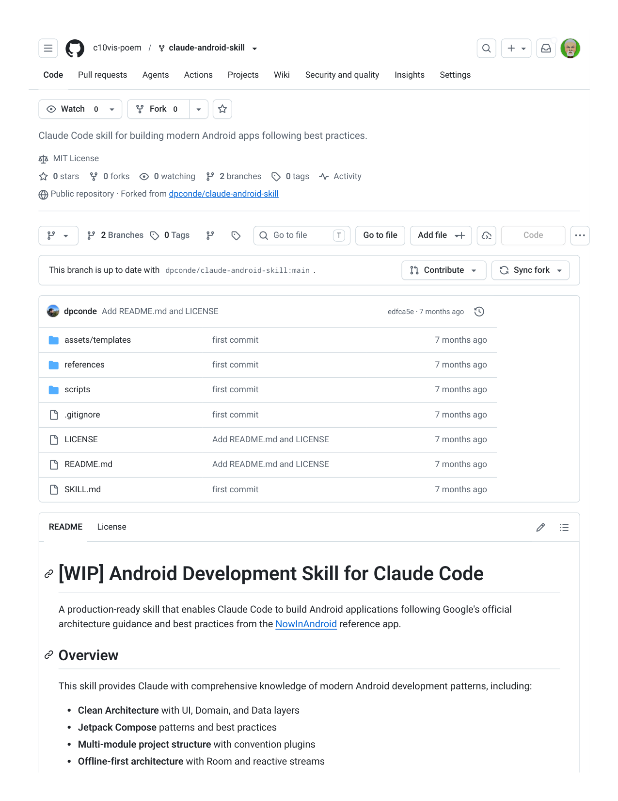
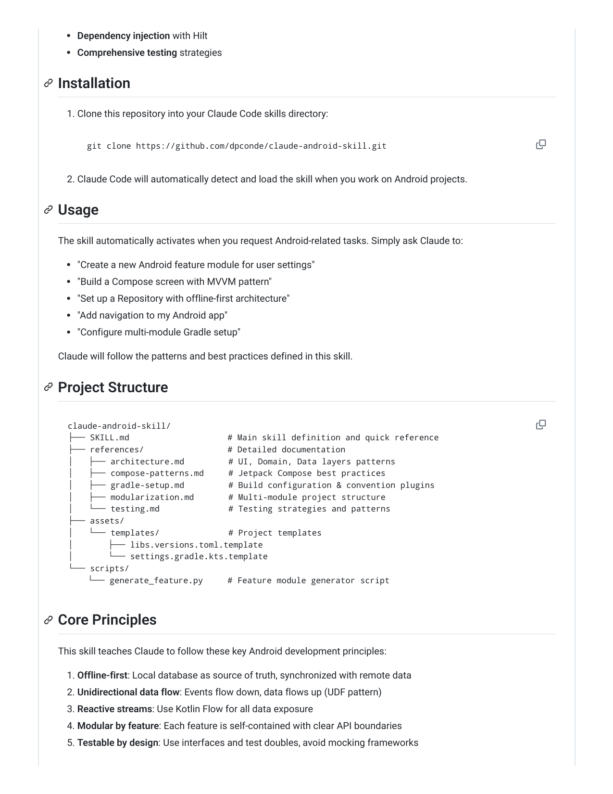
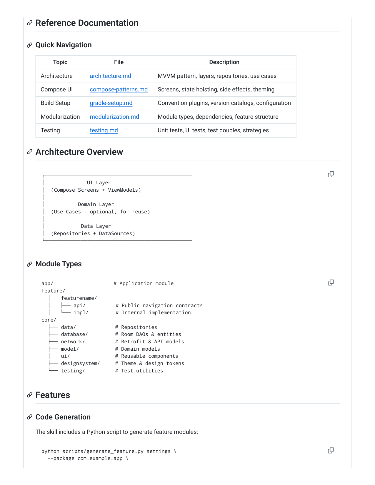
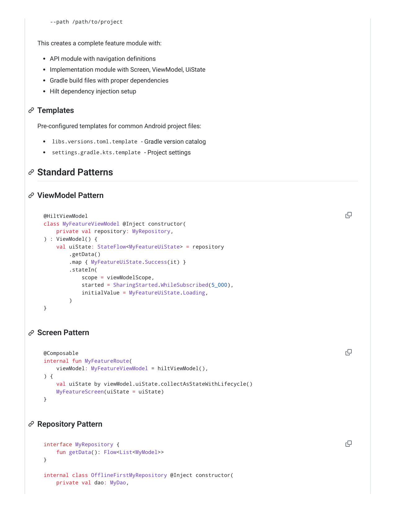
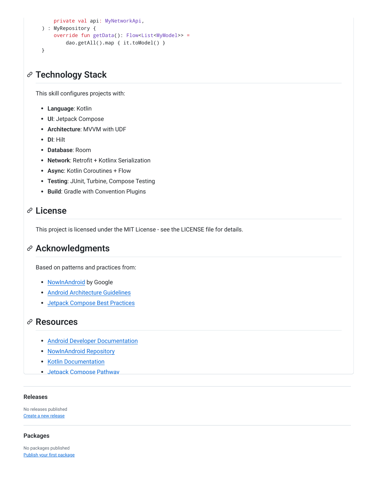
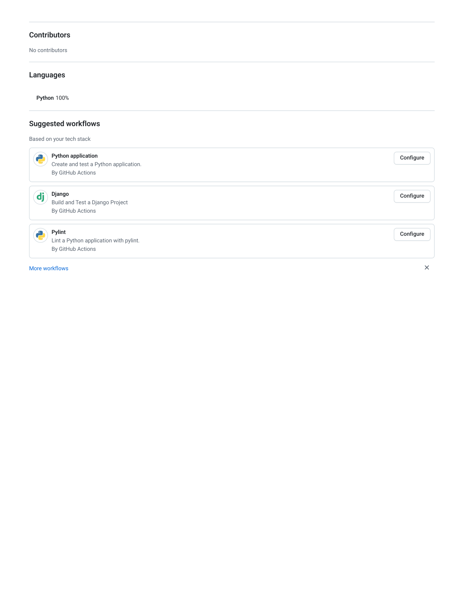

# c10vis-poem／claude-android-skill: Claude Code skill for building modern Android apps following best practices.

Watch
0
Claude Code skill for building modern Android apps following best practices.
MIT License
0 stars
0 forks
0 watching
2 branches
0 tags
Activity
Public repository · Forked from dpconde/claude-android-skill
2 Branches
0 Tags
Go to file
Go to file
Add file
Code
This branch is up to date with dpconde/claude-android-skill:main .
Contribute
Sync fork
dpconde Add README.md and LICENSE
edfca5e · 7 months ago
assets/templates
first commit
7 months ago
references
first commit
7 months ago
scripts
first commit
7 months ago
.gitignore
first commit
7 months ago
LICENSE
Add README.md and LICENSE
7 months ago
README.md
Add README.md and LICENSE
7 months ago
SKILL.md
first commit
7 months ago
A production-ready skill that enables Claude Code to build Android applications following Google's official
architecture guidance and best practices from the NowInAndroid reference app.
This skill provides Claude with comprehensive knowledge of modern Android development patterns, including:
Clean Architecture with UI, Domain, and Data layers
Jetpack Compose patterns and best practices
Multi-module project structure with convention plugins
Offline-first architecture with Room and reactive streams
c10vis-poem
claude-android-skill
Code
Pull requests
Agents
Actions
Projects
Wiki
Security and quality
Insights
Settings
Fork
0
T
[WIP] Android Development Skill for Claude Code
Overview
README
License

Dependency injection with Hilt
Comprehensive testing strategies
1. Clone this repository into your Claude Code skills directory:
2. Claude Code will automatically detect and load the skill when you work on Android projects.
The skill automatically activates when you request Android-related tasks. Simply ask Claude to:
"Create a new Android feature module for user settings"
"Build a Compose screen with MVVM pattern"
"Set up a Repository with offline-first architecture"
"Add navigation to my Android app"
"Configure multi-module Gradle setup"
Claude will follow the patterns and best practices defined in this skill.
This skill teaches Claude to follow these key Android development principles:
1. Offline-first: Local database as source of truth, synchronized with remote data
2. Unidirectional data flow: Events flow down, data flows up (UDF pattern)
3. Reactive streams: Use Kotlin Flow for all data exposure
4. Modular by feature: Each feature is self-contained with clear API boundaries
5. Testable by design: Use interfaces and test doubles, avoid mocking frameworks
Installation
git clone https://github.com/dpconde/claude-android-skill.git
Usage
Project Structure
claude-android-skill/
├── SKILL.md                    # Main skill definition and quick reference
├── references/                 # Detailed documentation
│   ├── architecture.md         # UI, Domain, Data layers patterns
│   ├── compose-patterns.md     # Jetpack Compose best practices
│   ├── gradle-setup.md         # Build configuration & convention plugins
│   ├── modularization.md       # Multi-module project structure
│   └── testing.md              # Testing strategies and patterns
├── assets/
│   └── templates/              # Project templates
│       ├── libs.versions.toml.template
│       └── settings.gradle.kts.template
└── scripts/
    └── generate_feature.py     # Feature module generator script
Core Principles

Topic
File
Description
Architecture
architecture.md
MVVM pattern, layers, repositories, use cases
Compose UI
compose-patterns.md
Screens, state hoisting, side effects, theming
Build Setup
gradle-setup.md
Convention plugins, version catalogs, configuration
Modularization
modularization.md
Module types, dependencies, feature structure
Testing
testing.md
Unit tests, UI tests, test doubles, strategies
The skill includes a Python script to generate feature modules:
Reference Documentation
Quick Navigation
Architecture Overview
┌─────────────────────────────────────────┐
│              UI Layer                    │
│  (Compose Screens + ViewModels)          │
├─────────────────────────────────────────┤
│           Domain Layer                   │
│  (Use Cases - optional, for reuse)       │
├─────────────────────────────────────────┤
│            Data Layer                    │
│  (Repositories + DataSources)            │
└─────────────────────────────────────────┘
Module Types
app/                    # Application module
feature/
  ├── featurename/
  │   ├── api/          # Public navigation contracts
  │   └── impl/         # Internal implementation
core/
  ├── data/             # Repositories
  ├── database/         # Room DAOs & entities
  ├── network/          # Retrofit & API models
  ├── model/            # Domain models
  ├── ui/               # Reusable components
  ├── designsystem/     # Theme & design tokens
  └── testing/          # Test utilities
Features
Code Generation
python scripts/generate_feature.py settings \
  --package com.example.app \

This creates a complete feature module with:
API module with navigation definitions
Implementation module with Screen, ViewModel, UiState
Gradle build files with proper dependencies
Hilt dependency injection setup
Pre-configured templates for common Android project files:
libs.versions.toml.template - Gradle version catalog
settings.gradle.kts.template - Project settings
  --path /path/to/project
Templates
Standard Patterns
ViewModel Pattern
@HiltViewModel
class MyFeatureViewModel @Inject constructor(
    private val repository: MyRepository,
) : ViewModel() {
    val uiState: StateFlow<MyFeatureUiState> = repository
        .getData()
        .map { MyFeatureUiState.Success(it) }
        .stateIn(
            scope = viewModelScope,
            started = SharingStarted.WhileSubscribed(5_000),
            initialValue = MyFeatureUiState.Loading,
        )
}
Screen Pattern
@Composable
internal fun MyFeatureRoute(
    viewModel: MyFeatureViewModel = hiltViewModel(),
) {
    val uiState by viewModel.uiState.collectAsStateWithLifecycle()
    MyFeatureScreen(uiState = uiState)
}
Repository Pattern
interface MyRepository {
    fun getData(): Flow<List<MyModel>>
}
internal class OfflineFirstMyRepository @Inject constructor(
    private val dao: MyDao,

This skill configures projects with:
Language: Kotlin
UI: Jetpack Compose
Architecture: MVVM with UDF
DI: Hilt
Database: Room
Network: Retrofit + Kotlinx Serialization
Async: Kotlin Coroutines + Flow
Testing: JUnit, Turbine, Compose Testing
Build: Gradle with Convention Plugins
This project is licensed under the MIT License - see the LICENSE file for details.
Based on patterns and practices from:
NowInAndroid by Google
Android Architecture Guidelines
Jetpack Compose Best Practices
Android Developer Documentation
NowInAndroid Repository
Kotlin Documentation
Jetpack Compose Pathway
Releases
No releases published
Create a new release
Packages
No packages published
Publish your first package
    private val api: MyNetworkApi,
) : MyRepository {
    override fun getData(): Flow<List<MyModel>> =
        dao.getAll().map { it.toModel() }
}
Technology Stack
License
Acknowledgments
Resources

Contributors
No contributors
Languages
Python 100%
Suggested workflows
Based on your tech stack
Python application
Create and test a Python application.
By GitHub Actions
Configure
Django
Build and Test a Django Project
By GitHub Actions
Configure
Pylint
Lint a Python application with pylint.
By GitHub Actions
Configure
More workflows

## Extracted images

(pulled from the source doc by `.migrate/extract_images.py` -- Markdown conversion drops these; see `c10vis-poem／claude-android-skill: Claude Code skill for building modern Android apps following best practices..pdf_images/`)

-  -- embedded raster
-  -- embedded raster
-  -- embedded raster
-  -- embedded raster
-  -- embedded raster
-  -- page 1 render (304 vector ops)
-  -- page 2 render (52 vector ops)
-  -- page 3 render (184 vector ops)
-  -- page 4 render (62 vector ops)
-  -- page 5 render (80 vector ops)
-  -- page 6 render (78 vector ops)
