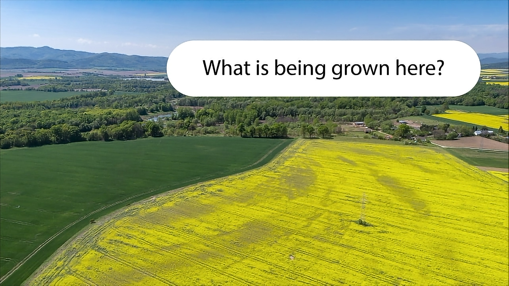
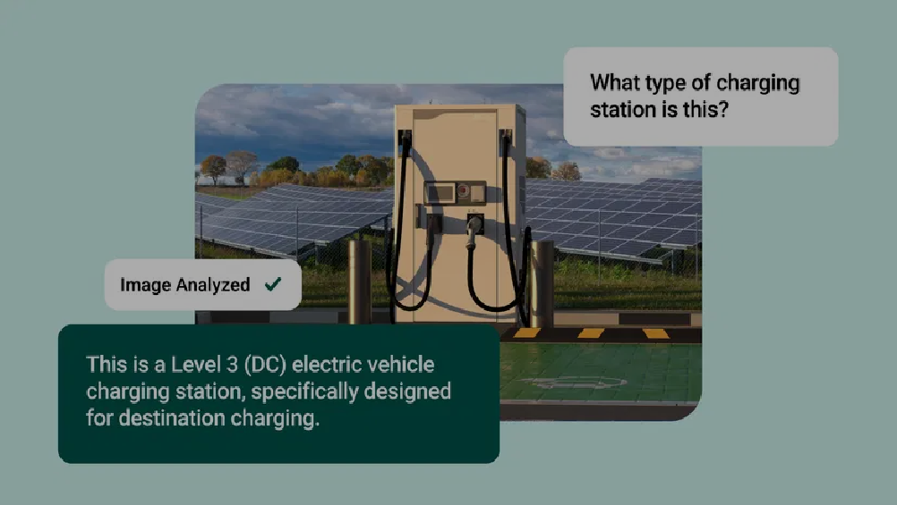
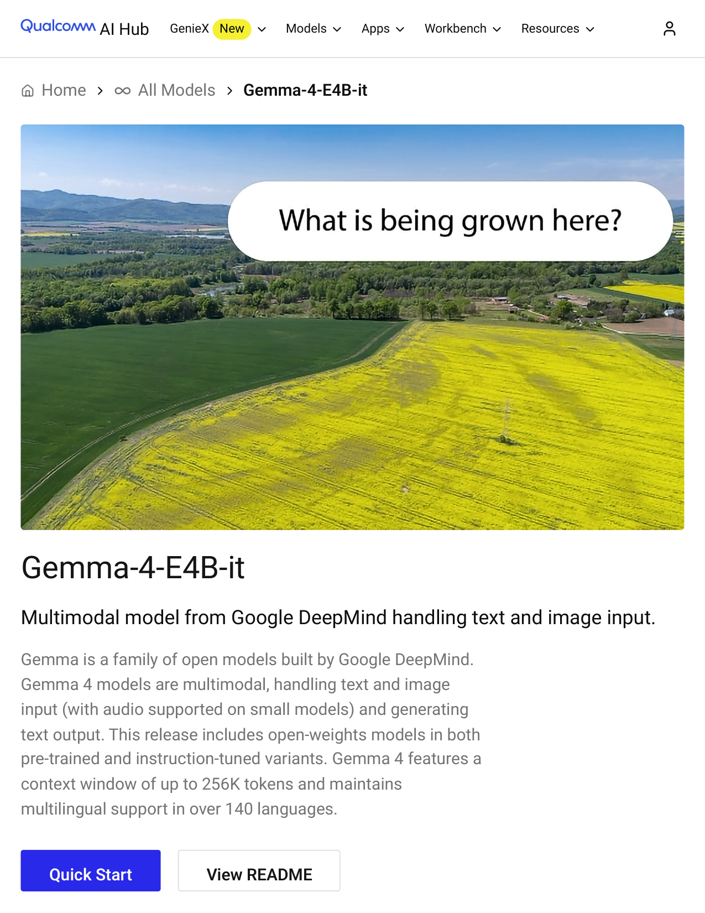
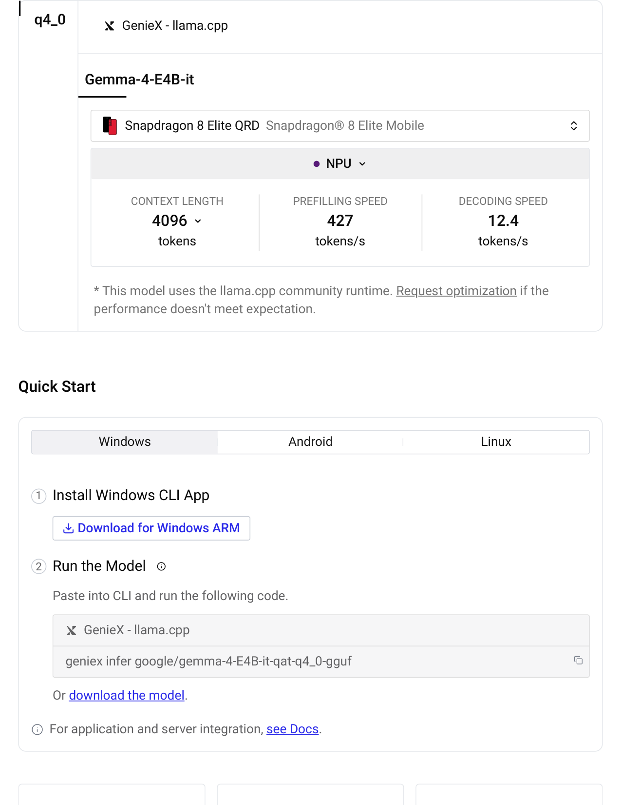
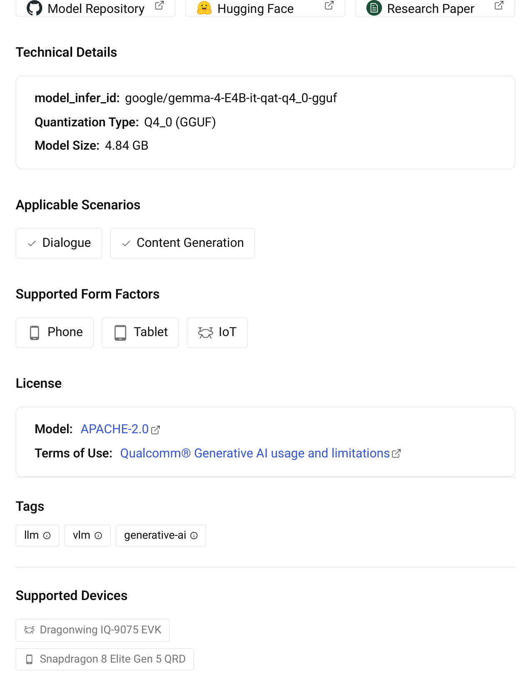
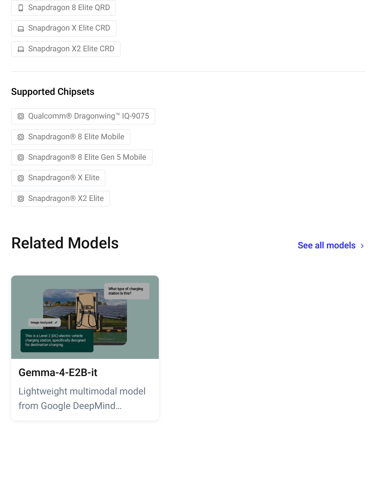

# Gemma-4-E4B-it - Qualcomm AI Hub

Home
All Models
Gemma-4-E4B-it
Gemma-4-E4B-it
Multimodal model from Google DeepMind handling text and image input.
Gemma is a family of open models built by Google DeepMind.
Gemma 4 models are multimodal, handling text and image
input (with audio supported on small models) and generating
text output. This release includes open‑weights models in both
pre‑trained and instruction‑tuned variants. Gemma 4 features a
context window of up to 256K tokens and maintains
multilingual support in over 140 languages.
Quick Start
View README
AI Hub
GenieX
New
Models
Apps
Workbench
Resources

GenieX - llama.cpp
* This model uses the llama.cpp community runtime. Request optimization if the
performance doesn't meet expectation.
Quick Start
1 Install Windows CLI App
Download for Windows ARM
2 Run the Model
Paste into CLI and run the following code.
geniex infer google/gemma-4-E4B-it-qat-q4_0-gguf
Or download the model.
For application and server integration, see Docs.
q4_0
Gemma-4-E4B-it
Snapdragon 8 Elite QRD Snapdragon® 8 Elite Mobile
CONTEXT LENGTH
tokens
PREFILLING SPEED
427
tokens/s
DECODING SPEED
12.4
tokens/s
NPU
4096
Windows
Android
Linux
GenieX - llama.cpp

Model Repository
Hugging Face
Research Paper
Technical Details
model_infer_id: google/gemma-4-E4B-it-qat-q4_0-gguf
Quantization Type: Q4_0 (GGUF)
Model Size: 4.84 GB
Applicable Scenarios
Dialogue
Content Generation
Supported Form Factors
Phone
Tablet
IoT
License
Model: APACHE-2.0
Terms of Use: Qualcomm® Generative AI usage and limitations
Tags
llm
vlm
generative-ai
Supported Devices
Dragonwing IQ-9075 EVK
Snapdragon 8 Elite Gen 5 QRD

Snapdragon 8 Elite QRD
Snapdragon X Elite CRD
Snapdragon X2 Elite CRD
Supported Chipsets
Qualcomm® Dragonwing™ IQ-9075
Snapdragon® 8 Elite Mobile
Snapdragon® 8 Elite Gen 5 Mobile
Snapdragon® X Elite
Snapdragon® X2 Elite
Related Models
See all models
Gemma-4-E2B-it
Lightweight multimodal model
from Google DeepMind…

Looking for more?
See models created
by industry leaders.
Discover Model Makers
Terms of Use
Privacy Policy
Cookie Policy
Contact Us
Do Not Sell or Share My Personal Information
© 2026 Qualcomm Technologies, Inc. and/or its affiliated companies.
References to "Qualcomm" may mean Qualcomm Incorporated, or subsidiaries or business units within the Qualcomm
corporate structure, as applicable.
Qualcomm Incorporated includes our licensing business, QTL, and the vast majority of our patent portfolio. Qualcomm
Technologies, Inc., a subsidiary of Qualcomm Incorporated, operates, along with its subsidiaries, substantially all of our
engineering, research and development functions, and substantially all of our products and services businesses,
including our QCT semiconductor business.
Materials that are as of a specific date, including but not limited to press releases, presentations, blog posts and
webcasts, may have been superseded by subsequent events or disclosures.
Nothing in these materials is an offer to sell any of the components or devices referenced herein.

## Extracted images

(pulled from the source doc by `.migrate/extract_images.py` -- Markdown conversion drops these; see `Gemma-4-E4B-it - Qualcomm AI Hub.pdf_images/`)

-  -- embedded raster
-  -- embedded raster
-  -- embedded raster
-  -- embedded raster
-  -- page 1 render (42 vector ops)
-  -- page 2 render (148 vector ops)
-  -- page 3 render (194 vector ops)
-  -- page 4 render (196 vector ops)
-  -- page 5 render (22 vector ops)
