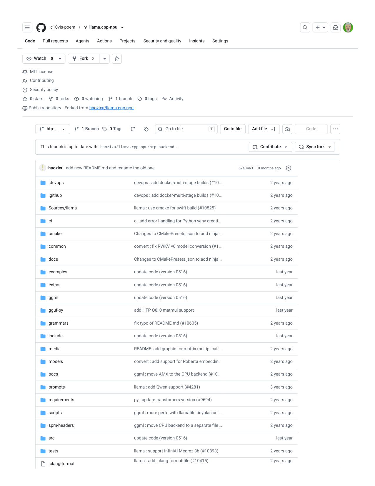
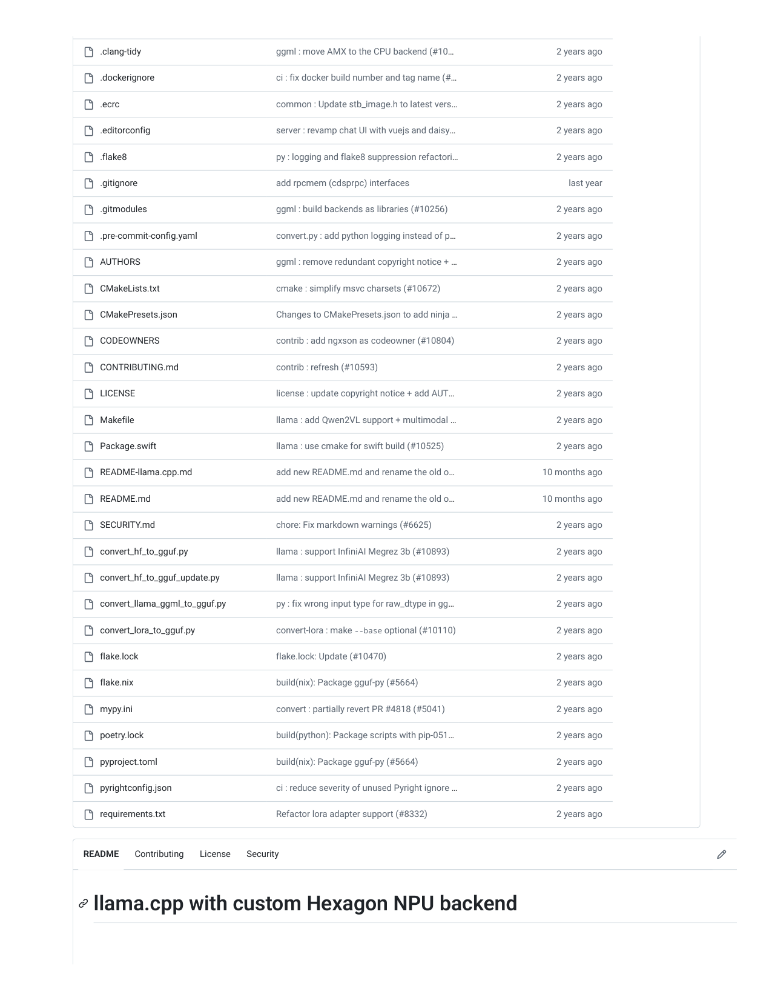
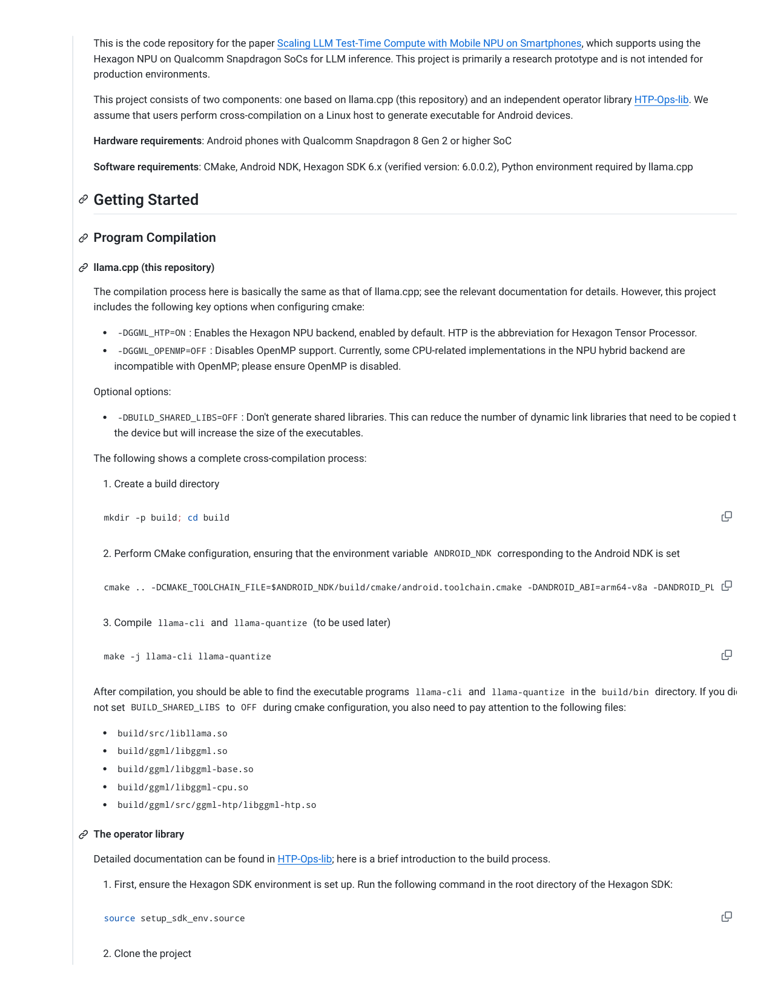
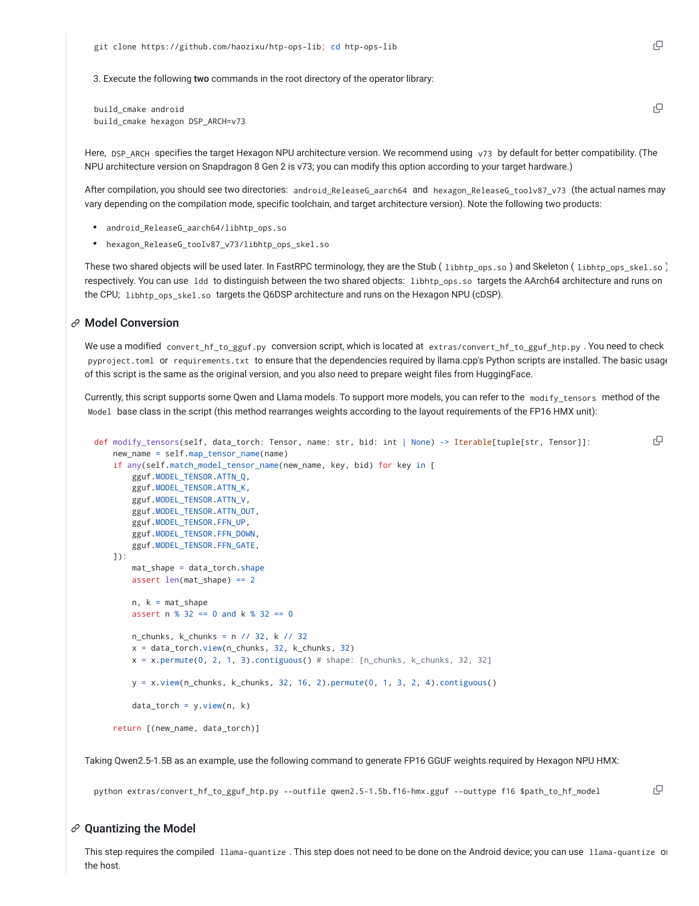
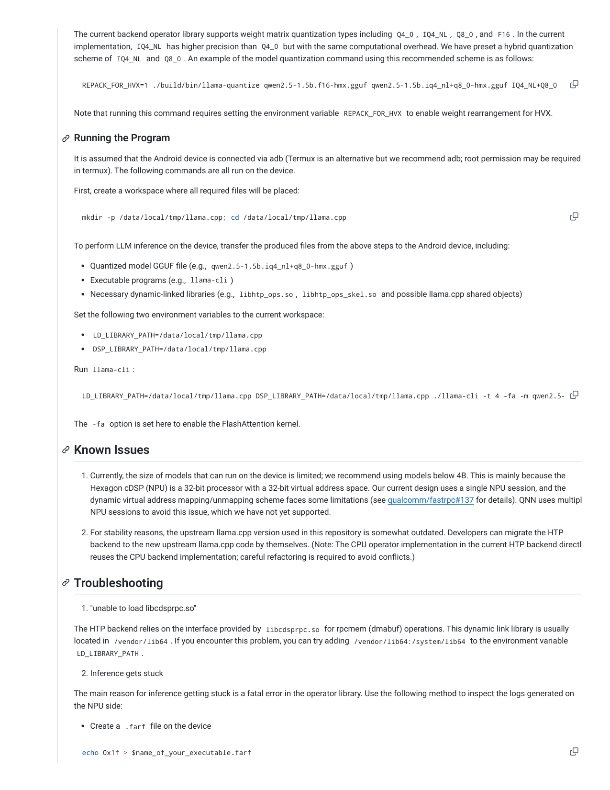
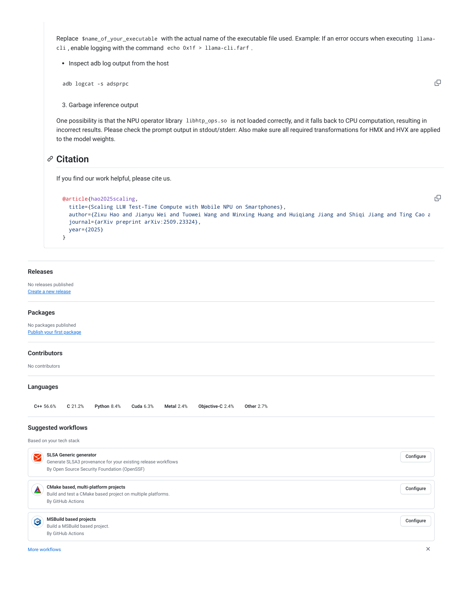

# c10vis-poem／llama.cpp-npu

Watch
0

MIT License

Contributing

Security policy

0 stars
0 forks
0 watching
1 branch
0 tags
Activity

Public repository · Forked from haozixu/llama.cpp-npu

1 Branch
0 Tags
Go to file
Go to file
Add file
Code

This branch is up to date with haozixu/llama.cpp-npu:htp-backend .
Contribute
Sync fork

haozixu add new README.md and rename the old one
57e34a3 · 10 months ago

.devops
devops : add docker-multi-stage builds (#10…
2 years ago

.github
devops : add docker-multi-stage builds (#10…
2 years ago

Sources/llama
llama : use cmake for swift build (#10525)
2 years ago

ci
ci: add error handling for Python venv creati…
2 years ago

cmake
Changes to CMakePresets.json to add ninja …
2 years ago

common
convert : fix RWKV v6 model conversion (#1…
2 years ago

docs
Changes to CMakePresets.json to add ninja …
2 years ago

examples
update code (version 0516)
last year

extras
update code (version 0516)
last year

ggml
update code (version 0516)
last year

gguf-py
add HTP Q8_0 matmul support
last year

grammars
fix typo of README.md (#10605)
2 years ago

include
update code (version 0516)
last year

media
README: add graphic for matrix multiplicati…
2 years ago

models
convert : add support for Roberta embeddin…
2 years ago

pocs
ggml : move AMX to the CPU backend (#10…
2 years ago

prompts
llama : add Qwen support (#4281)
3 years ago

requirements
py : update transfomers version (#9694)
2 years ago

scripts
ggml : more perfo with llamafile tinyblas on …
2 years ago

spm-headers
ggml : move CPU backend to a separate file …
2 years ago

src
update code (version 0516)
last year

tests
llama : support InfiniAI Megrez 3b (#10893)
2 years ago

.clang-format
llama : add .clang-format file (#10415)
2 years ago

c10vis-poem
llama.cpp-npu

Code
Pull requests
Agents
Actions
Projects
Security and quality
Insights
Settings

Fork
0

htp-…
T

.clang-tidy
ggml : move AMX to the CPU backend (#10…
2 years ago

.dockerignore
ci : fix docker build number and tag name (#…
2 years ago

.ecrc
common : Update stb_image.h to latest vers…
2 years ago

.editorconfig
server : revamp chat UI with vuejs and daisy…
2 years ago

.flake8
py : logging and flake8 suppression refactori…
2 years ago

.gitignore
add rpcmem (cdsprpc) interfaces
last year

.gitmodules
ggml : build backends as libraries (#10256)
2 years ago

.pre-commit-config.yaml
convert.py : add python logging instead of p…
2 years ago

AUTHORS
ggml : remove redundant copyright notice + …
2 years ago

CMakeLists.txt
cmake : simplify msvc charsets (#10672)
2 years ago

CMakePresets.json
Changes to CMakePresets.json to add ninja …
2 years ago

CODEOWNERS
contrib : add ngxson as codeowner (#10804)
2 years ago

CONTRIBUTING.md
contrib : refresh (#10593)
2 years ago

LICENSE
license : update copyright notice + add AUT…
2 years ago

Makefile
llama : add Qwen2VL support + multimodal …
2 years ago

Package.swift
llama : use cmake for swift build (#10525)
2 years ago

README-llama.cpp.md
add new README.md and rename the old o…
10 months ago

README.md
add new README.md and rename the old o…
10 months ago

SECURITY.md
chore: Fix markdown warnings (#6625)
2 years ago

convert_hf_to_gguf.py
llama : support InfiniAI Megrez 3b (#10893)
2 years ago

convert_hf_to_gguf_update.py
llama : support InfiniAI Megrez 3b (#10893)
2 years ago

convert_llama_ggml_to_gguf.py
py : fix wrong input type for raw_dtype in gg…
2 years ago

convert_lora_to_gguf.py
convert-lora : make --base optional (#10110)
2 years ago

flake.lock
flake.lock: Update (#10470)
2 years ago

flake.nix
build(nix): Package gguf-py (#5664)
2 years ago

mypy.ini
convert : partially revert PR #4818 (#5041)
2 years ago

poetry.lock
build(python): Package scripts with pip-051…
2 years ago

pyproject.toml
build(nix): Package gguf-py (#5664)
2 years ago

pyrightconfig.json
ci : reduce severity of unused Pyright ignore …
2 years ago

requirements.txt
Refactor lora adapter support (#8332)
2 years ago

llama.cpp with custom Hexagon NPU backend

README
Contributing
License
Security

This is the code repository for the paper Scaling LLM Test-Time Compute with Mobile NPU on Smartphones, which supports using the
Hexagon NPU on Qualcomm Snapdragon SoCs for LLM inference. This project is primarily a research prototype and is not intended for

production environments.

This project consists of two components: one based on llama.cpp (this repository) and an independent operator library HTP-Ops-lib. We
assume that users perform cross-compilation on a Linux host to generate executable for Android devices.

Hardware requirements: Android phones with Qualcomm Snapdragon 8 Gen 2 or higher SoC

Software requirements: CMake, Android NDK, Hexagon SDK 6.x (verified version: 6.0.0.2), Python environment required by llama.cpp

The compilation process here is basically the same as that of llama.cpp; see the relevant documentation for details. However, this project
includes the following key options when configuring cmake:

-DGGML_HTP=ON : Enables the Hexagon NPU backend, enabled by default. HTP is the abbreviation for Hexagon Tensor Processor.

-DGGML_OPENMP=OFF : Disables OpenMP support. Currently, some CPU-related implementations in the NPU hybrid backend are

incompatible with OpenMP; please ensure OpenMP is disabled.

Optional options:

-DBUILD_SHARED_LIBS=OFF : Don't generate shared libraries. This can reduce the number of dynamic link libraries that need to be copied t

the device but will increase the size of the executables.

The following shows a complete cross-compilation process:

1. Create a build directory

2. Perform CMake configuration, ensuring that the environment variable ANDROID_NDK  corresponding to the Android NDK is set

3. Compile llama-cli  and llama-quantize  (to be used later)

After compilation, you should be able to find the executable programs llama-cli  and llama-quantize  in the build/bin  directory. If you did
not set BUILD_SHARED_LIBS  to OFF  during cmake configuration, you also need to pay attention to the following files:

build/src/libllama.so

build/ggml/libggml.so

build/ggml/libggml-base.so

build/ggml/libggml-cpu.so

build/ggml/src/ggml-htp/libggml-htp.so

Detailed documentation can be found in HTP-Ops-lib; here is a brief introduction to the build process.

1. First, ensure the Hexagon SDK environment is set up. Run the following command in the root directory of the Hexagon SDK:

2. Clone the project

Getting Started

Program Compilation

llama.cpp (this repository)

mkdir -p build; cd build

cmake .. -DCMAKE_TOOLCHAIN_FILE=$ANDROID_NDK/build/cmake/android.toolchain.cmake -DANDROID_ABI=arm64-v8a -DANDROID_PL

make -j llama-cli llama-quantize

The operator library

source setup_sdk_env.source

3. Execute the following two commands in the root directory of the operator library:

Here, DSP_ARCH  specifies the target Hexagon NPU architecture version. We recommend using v73  by default for better compatibility. (The
NPU architecture version on Snapdragon 8 Gen 2 is v73; you can modify this option according to your target hardware.)

After compilation, you should see two directories: android_ReleaseG_aarch64  and hexagon_ReleaseG_toolv87_v73  (the actual names may
vary depending on the compilation mode, specific toolchain, and target architecture version). Note the following two products:

android_ReleaseG_aarch64/libhtp_ops.so

hexagon_ReleaseG_toolv87_v73/libhtp_ops_skel.so

These two shared objects will be used later. In FastRPC terminology, they are the Stub ( libhtp_ops.so ) and Skeleton ( libhtp_ops_skel.so )
respectively. You can use ldd  to distinguish between the two shared objects: libhtp_ops.so  targets the AArch64 architecture and runs on
the CPU; libhtp_ops_skel.so  targets the Q6DSP architecture and runs on the Hexagon NPU (cDSP).

We use a modified convert_hf_to_gguf.py  conversion script, which is located at extras/convert_hf_to_gguf_htp.py . You need to check

pyproject.toml  or requirements.txt  to ensure that the dependencies required by llama.cpp's Python scripts are installed. The basic usage

of this script is the same as the original version, and you also need to prepare weight files from HuggingFace.

Currently, this script supports some Qwen and Llama models. To support more models, you can refer to the modify_tensors  method of the

Model  base class in the script (this method rearranges weights according to the layout requirements of the FP16 HMX unit):

Taking Qwen2.5-1.5B as an example, use the following command to generate FP16 GGUF weights required by Hexagon NPU HMX:

This step requires the compiled llama-quantize . This step does not need to be done on the Android device; you can use llama-quantize  on
the host.

git clone https://github.com/haozixu/htp-ops-lib; cd htp-ops-lib

build_cmake android
build_cmake hexagon DSP_ARCH=v73

Model Conversion

def modify_tensors(self, data_torch: Tensor, name: str, bid: int | None) -> Iterable[tuple[str, Tensor]]:
    new_name = self.map_tensor_name(name)
    if any(self.match_model_tensor_name(new_name, key, bid) for key in [
        gguf.MODEL_TENSOR.ATTN_Q,
        gguf.MODEL_TENSOR.ATTN_K,
        gguf.MODEL_TENSOR.ATTN_V,
        gguf.MODEL_TENSOR.ATTN_OUT,
        gguf.MODEL_TENSOR.FFN_UP,
        gguf.MODEL_TENSOR.FFN_DOWN,
        gguf.MODEL_TENSOR.FFN_GATE,
    ]):
        mat_shape = data_torch.shape
        assert len(mat_shape) == 2

        n, k = mat_shape
        assert n % 32 == 0 and k % 32 == 0

        n_chunks, k_chunks = n // 32, k // 32
        x = data_torch.view(n_chunks, 32, k_chunks, 32)
        x = x.permute(0, 2, 1, 3).contiguous() # shape: [n_chunks, k_chunks, 32, 32]

        y = x.view(n_chunks, k_chunks, 32, 16, 2).permute(0, 1, 3, 2, 4).contiguous()

        data_torch = y.view(n, k)

    return [(new_name, data_torch)]

python extras/convert_hf_to_gguf_htp.py --outfile qwen2.5-1.5b.f16-hmx.gguf --outtype f16 $path_to_hf_model

Quantizing the Model

The current backend operator library supports weight matrix quantization types including Q4_0 , IQ4_NL , Q8_0 , and F16 . In the current
implementation, IQ4_NL  has higher precision than Q4_0  but with the same computational overhead. We have preset a hybrid quantization

scheme of IQ4_NL  and Q8_0 . An example of the model quantization command using this recommended scheme is as follows:

Note that running this command requires setting the environment variable REPACK_FOR_HVX  to enable weight rearrangement for HVX.

It is assumed that the Android device is connected via adb (Termux is an alternative but we recommend adb; root permission may be required
in termux). The following commands are all run on the device.

First, create a workspace where all required files will be placed:

To perform LLM inference on the device, transfer the produced files from the above steps to the Android device, including:

Quantized model GGUF file (e.g., qwen2.5-1.5b.iq4_nl+q8_0-hmx.gguf )

Executable programs (e.g., llama-cli )

Necessary dynamic-linked libraries (e.g., libhtp_ops.so , libhtp_ops_skel.so  and possible llama.cpp shared objects)

Set the following two environment variables to the current workspace:

LD_LIBRARY_PATH=/data/local/tmp/llama.cpp

DSP_LIBRARY_PATH=/data/local/tmp/llama.cpp

Run llama-cli :

The -fa  option is set here to enable the FlashAttention kernel.

1. Currently, the size of models that can run on the device is limited; we recommend using models below 4B. This is mainly because the

Hexagon cDSP (NPU) is a 32-bit processor with a 32-bit virtual address space. Our current design uses a single NPU session, and the
dynamic virtual address mapping/unmapping scheme faces some limitations (see qualcomm/fastrpc#137 for details). QNN uses multipl
NPU sessions to avoid this issue, which we have not yet supported.

2. For stability reasons, the upstream llama.cpp version used in this repository is somewhat outdated. Developers can migrate the HTP

backend to the new upstream llama.cpp code by themselves. (Note: The CPU operator implementation in the current HTP backend directly
reuses the CPU backend implementation; careful refactoring is required to avoid conflicts.)

1. "unable to load libcdsprpc.so"

The HTP backend relies on the interface provided by libcdsprpc.so  for rpcmem (dmabuf) operations. This dynamic link library is usually
located in /vendor/lib64 . If you encounter this problem, you can try adding /vendor/lib64:/system/lib64  to the environment variable

LD_LIBRARY_PATH .

2. Inference gets stuck

The main reason for inference getting stuck is a fatal error in the operator library. Use the following method to inspect the logs generated on
the NPU side:

Create a .farf  file on the device

REPACK_FOR_HVX=1 ./build/bin/llama-quantize qwen2.5-1.5b.f16-hmx.gguf qwen2.5-1.5b.iq4_nl+q8_0-hmx.gguf IQ4_NL+Q8_0

Running the Program

mkdir -p /data/local/tmp/llama.cpp; cd /data/local/tmp/llama.cpp

LD_LIBRARY_PATH=/data/local/tmp/llama.cpp DSP_LIBRARY_PATH=/data/local/tmp/llama.cpp ./llama-cli -t 4 -fa -m qwen2.5-

Known Issues

Troubleshooting

echo 0x1f > $name_of_your_executable.farf

Replace $name_of_your_executable  with the actual name of the executable file used. Example: If an error occurs when executing llama-

cli , enable logging with the command echo 0x1f > llama-cli.farf .

Inspect adb log output from the host

3. Garbage inference output

One possibility is that the NPU operator library libhtp_ops.so  is not loaded correctly, and it falls back to CPU computation, resulting in
incorrect results. Please check the prompt output in stdout/stderr. Also make sure all required transformations for HMX and HVX are applied
to the model weights.

If you find our work helpful, please cite us.

Releases

No releases published

Create a new release

Packages

No packages published

Publish your first package

Contributors

No contributors

Languages

C++ 56.6%
C 21.2%
Python 8.4%
Cuda 6.3%
Metal 2.4%
Objective-C 2.4%
Other 2.7%

Suggested workflows

Based on your tech stack

SLSA Generic generator

Generate SLSA3 provenance for your existing release workflows

By Open Source Security Foundation (OpenSSF)

Configure

CMake based, multi-platform projects

Build and test a CMake based project on multiple platforms.

By GitHub Actions

Configure

MSBuild based projects
Build a MSBuild based project.

By GitHub Actions

Configure

More workflows

adb logcat -s adsprpc

Citation

@article{hao2025scaling,
  title={Scaling LLM Test-Time Compute with Mobile NPU on Smartphones},
  author={Zixu Hao and Jianyu Wei and Tuowei Wang and Minxing Huang and Huiqiang Jiang and Shiqi Jiang and Ting Cao a
  journal={arXiv preprint arXiv:2509.23324},
  year={2025}
}

## Extracted images

(pulled from the source doc by `.migrate/extract_images.py` -- Markdown conversion drops these; see `c10vis-poem／llama.cpp-npu.pdf_images/`)

-  -- embedded raster
-  -- embedded raster
-  -- embedded raster
-  -- embedded raster
-  -- embedded raster
-  -- embedded raster
-  -- embedded raster
-  -- page 1 render (404 vector ops)
-  -- page 2 render (266 vector ops)
-  -- page 3 render (100 vector ops)
-  -- page 4 render (82 vector ops)
-  -- page 5 render (104 vector ops)
-  -- page 6 render (146 vector ops)
