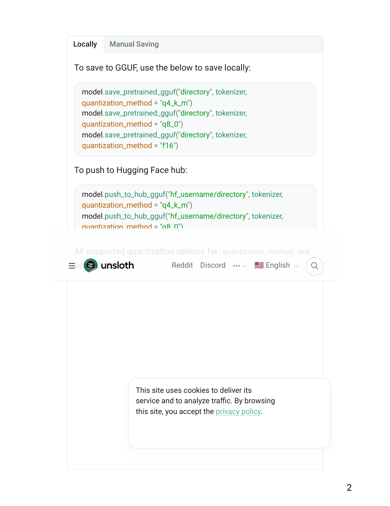
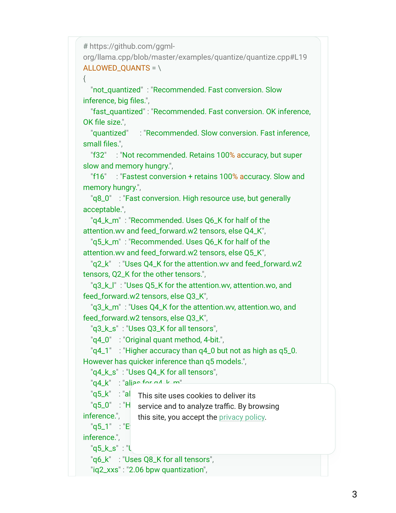
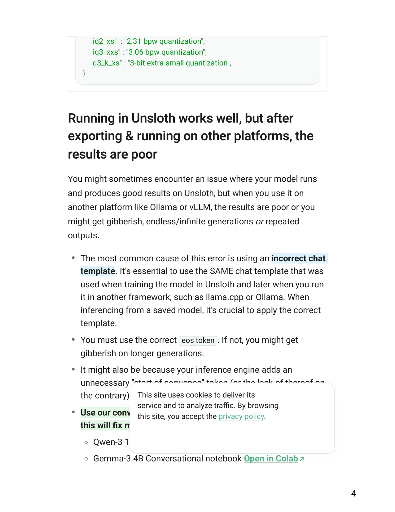
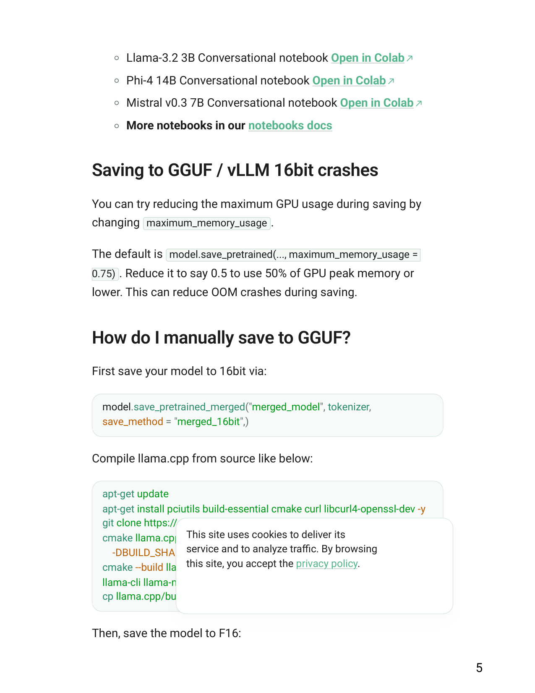
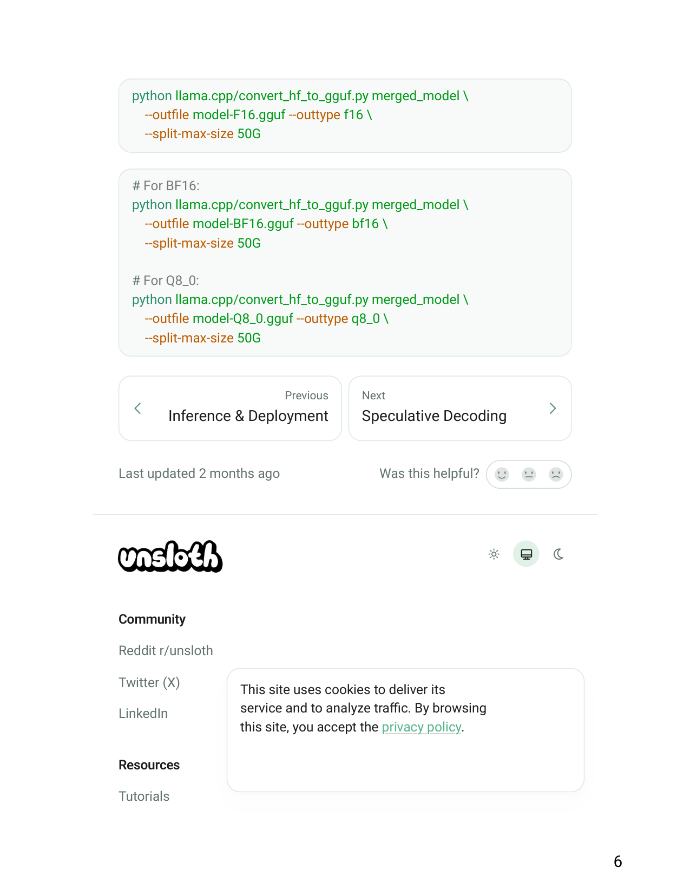
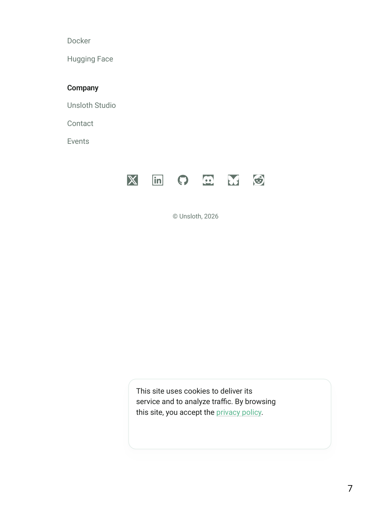

# Saving to GGUF - Unsloth Documentation

1
Basics
🖥️Inference & Deployment
Saving to GGUF
Saving models to 16bit for GGUF so you can use it for Unsloth
Studio, Ollama, llama.cpp and more!
Copy
This site uses cookies to deliver its
service and to analyze traffic. By browsing
this site, you accept the privacy policy.
Accept
Reject

2
To save to GGUF, use the below to save locally:
To push to Hugging Face hub:
All supported quantization options for quantization_method are
listed below:
Locally
Manual Saving
model.save_pretrained_gguf("directory", tokenizer,
quantization_method = "q4_k_m")
model.save_pretrained_gguf("directory", tokenizer,
quantization_method = "q8_0")
model.save_pretrained_gguf("directory", tokenizer,
quantization_method = "f16")
model.push_to_hub_gguf("hf_username/directory", tokenizer,
quantization_method = "q4_k_m")
model.push_to_hub_gguf("hf_username/directory", tokenizer,
quantization_method = "q8_0")
Reddit
Discord
🇺🇸 English
This site uses cookies to deliver its
service and to analyze traffic. By browsing
this site, you accept the privacy policy.

3
# https://github.com/ggml-
org/llama.cpp/blob/master/examples/quantize/quantize.cpp#L19
ALLOWED_QUANTS = \
{
"not_quantized" : "Recommended. Fast conversion. Slow
inference, big files.",
"fast_quantized" : "Recommended. Fast conversion. OK inference,
OK file size.",
"quantized"
: "Recommended. Slow conversion. Fast inference,
small files.",
"f32"
: "Not recommended. Retains 100% accuracy, but super
slow and memory hungry.",
"f16"
: "Fastest conversion + retains 100% accuracy. Slow and
memory hungry.",
"q8_0"
: "Fast conversion. High resource use, but generally
acceptable.",
"q4_k_m" : "Recommended. Uses Q6_K for half of the
attention.wv and feed_forward.w2 tensors, else Q4_K",
"q5_k_m" : "Recommended. Uses Q6_K for half of the
attention.wv and feed_forward.w2 tensors, else Q5_K",
"q2_k"
: "Uses Q4_K for the attention.wv and feed_forward.w2
tensors, Q2_K for the other tensors.",
"q3_k_l" : "Uses Q5_K for the attention.wv, attention.wo, and
feed_forward.w2 tensors, else Q3_K",
"q3_k_m" : "Uses Q4_K for the attention.wv, attention.wo, and
feed_forward.w2 tensors, else Q3_K",
"q3_k_s" : "Uses Q3_K for all tensors",
"q4_0"
: "Original quant method, 4-bit.",
"q4_1"
: "Higher accuracy than q4_0 but not as high as q5_0.
However has quicker inference than q5 models.",
"q4_k_s" : "Uses Q4_K for all tensors",
"q4_k"
: "alias for q4_k_m",
"q5_k"
: "alias for q5_k_m",
"q5_0"
: "Higher accuracy, higher resource usage and slower
inference.",
"q5_1"
: "Even higher accuracy, resource usage and slower
inference.",
"q5_k_s" : "Uses Q5_K for all tensors",
"q6_k"
: "Uses Q8_K for all tensors",
"iq2_xxs" : "2.06 bpw quantization",
This site uses cookies to deliver its
service and to analyze traffic. By browsing
this site, you accept the privacy policy.

4
You might sometimes encounter an issue where your model runs
and produces good results on Unsloth, but when you use it on
another platform like Ollama or vLLM, the results are poor or you
might get gibberish, endless/infinite generations or repeated
outputs.
• The most common cause of this error is using an incorrect chat
template. It’s essential to use the SAME chat template that was
used when training the model in Unsloth and later when you run
it in another framework, such as llama.cpp or Ollama. When
inferencing from a saved model, it's crucial to apply the correct
template.
• You must use the correct eos token . If not, you might get
gibberish on longer generations.
• It might also be because your inference engine adds an
unnecessary "start of sequence" token (or the lack of thereof on
the contrary) so ensure you check both hypotheses!
• Use our conversational notebooks to force the chat template -
this will fix most issues.
◦Qwen-3 14B Conversational notebook Open in Colab
◦Gemma-3 4B Conversational notebook Open in Colab
"iq2_xs" : "2.31 bpw quantization",
"iq3_xxs" : "3.06 bpw quantization",
"q3_k_xs" : "3-bit extra small quantization",
}
Running in Unsloth works well, but after
exporting & running on other platforms, the
results are poor
This site uses cookies to deliver its
service and to analyze traffic. By browsing
this site, you accept the privacy policy.

5
◦Llama-3.2 3B Conversational notebook Open in Colab
◦Phi-4 14B Conversational notebook Open in Colab
◦Mistral v0.3 7B Conversational notebook Open in Colab
◦More notebooks in our notebooks docs
You can try reducing the maximum GPU usage during saving by
changing maximum_memory_usage .
The default is model.save_pretrained(..., maximum_memory_usage =
0.75) . Reduce it to say 0.5 to use 50% of GPU peak memory or
lower. This can reduce OOM crashes during saving.
First save your model to 16bit via:
Compile llama.cpp from source like below:
Then, save the model to F16:
Saving to GGUF / vLLM 16bit crashes
How do I manually save to GGUF?
model.save_pretrained_merged("merged_model", tokenizer,
save_method = "merged_16bit",)
apt-get update
apt-get install pciutils build-essential cmake curl libcurl4-openssl-dev -y
git clone https://github.com/ggml-org/llama.cpp
cmake llama.cpp -B llama.cpp/build \
-DBUILD_SHARED_LIBS=OFF -DGGML_CUDA=ON -DLLAMA_CURL=ON
cmake --build llama.cpp/build --config Release -j --clean-first --target
llama-cli llama-mtmd-cli llama-server llama-gguf-split
cp llama.cpp/build/bin/llama-* llama.cpp
This site uses cookies to deliver its
service and to analyze traffic. By browsing
this site, you accept the privacy policy.

6
Community
Reddit r/unsloth
Twitter (X)
LinkedIn
Resources
Tutorials
Previous
Inference & Deployment
Next
Speculative Decoding
Last updated 2 months ago
Was this helpful?
python llama.cpp/convert_hf_to_gguf.py merged_model \
--outfile model-F16.gguf --outtype f16 \
--split-max-size 50G
# For BF16:
python llama.cpp/convert_hf_to_gguf.py merged_model \
--outfile model-BF16.gguf --outtype bf16 \
--split-max-size 50G
# For Q8_0:
python llama.cpp/convert_hf_to_gguf.py merged_model \
--outfile model-Q8_0.gguf --outtype q8_0 \
--split-max-size 50G
This site uses cookies to deliver its
service and to analyze traffic. By browsing
this site, you accept the privacy policy.

7
Docker
Hugging Face
Company
Unsloth Studio
Contact
Events
© Unsloth, 2026
This site uses cookies to deliver its
service and to analyze traffic. By browsing
this site, you accept the privacy policy.

## Extracted images

(pulled from the source doc by `.migrate/extract_images.py` -- Markdown conversion drops these; see `Saving to GGUF - Unsloth Documentation.pdf_images/`)

-  -- embedded raster
-  -- embedded raster
-  -- embedded raster
-  -- embedded raster
-  -- embedded raster
-  -- embedded raster
-  -- embedded raster
-  -- embedded raster
-  -- embedded raster
-  -- embedded raster
-  -- embedded raster
-  -- embedded raster
-  -- embedded raster
-  -- embedded raster
-  -- embedded raster
-  -- embedded raster
-  -- embedded raster
-  -- embedded raster
-  -- embedded raster
-  -- embedded raster
-  -- embedded raster
-  -- embedded raster
-  -- embedded raster
-  -- embedded raster
-  -- embedded raster
-  -- embedded raster
-  -- embedded raster
-  -- embedded raster
-  -- embedded raster
-  -- embedded raster
-  -- embedded raster
-  -- embedded raster
-  -- embedded raster
-  -- embedded raster
-  -- embedded raster
-  -- embedded raster
-  -- embedded raster
-  -- embedded raster
-  -- embedded raster
-  -- embedded raster
-  -- embedded raster
-  -- embedded raster
-  -- embedded raster
-  -- embedded raster
-  -- embedded raster
-  -- embedded raster
-  -- page 1 render (62 vector ops)
-  -- page 2 render (68 vector ops)
-  -- page 3 render (78 vector ops)
-  -- page 4 render (58 vector ops)
-  -- page 5 render (70 vector ops)
-  -- page 6 render (86 vector ops)
-  -- page 7 render (58 vector ops)
