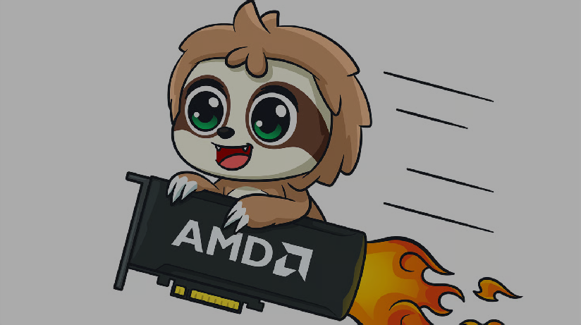
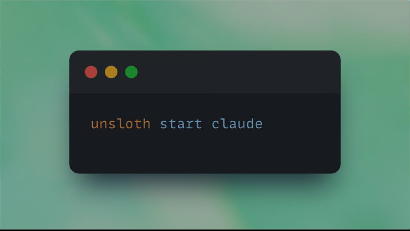
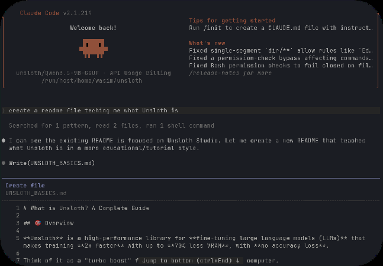
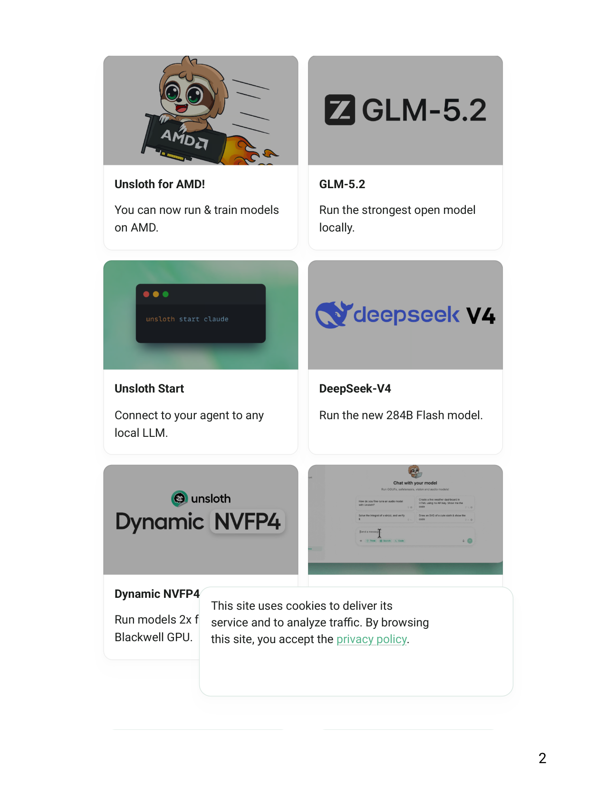
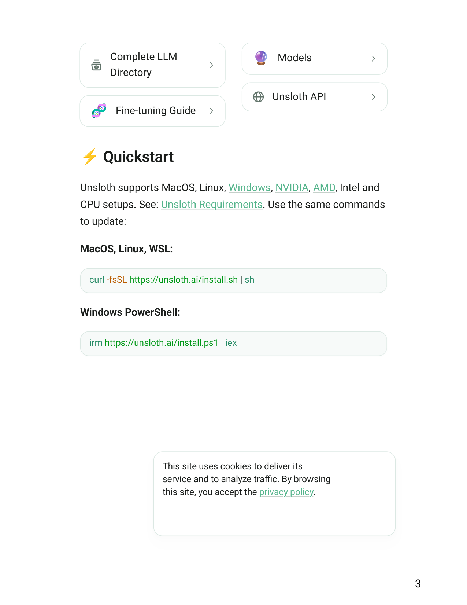
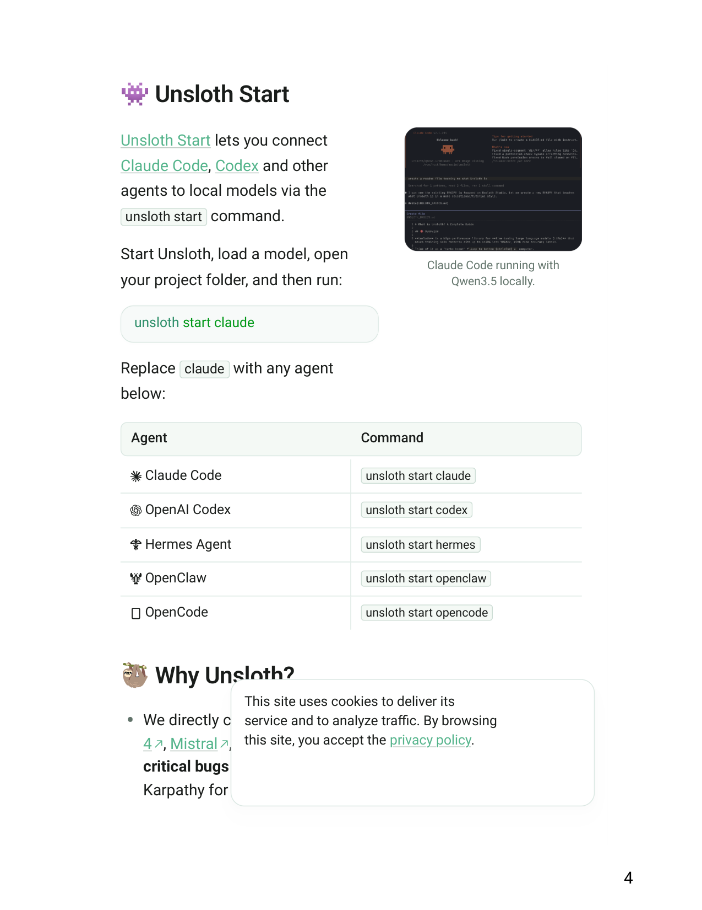
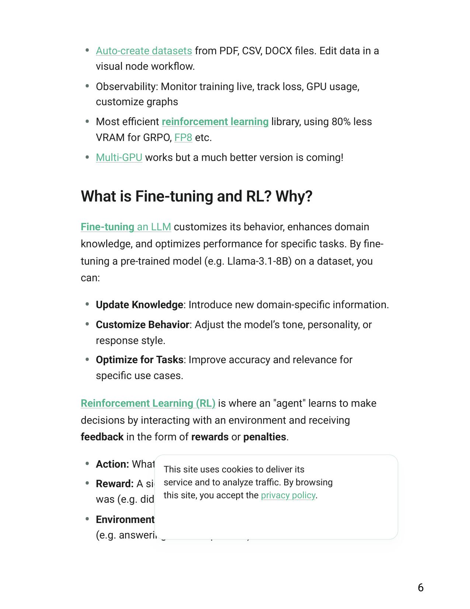
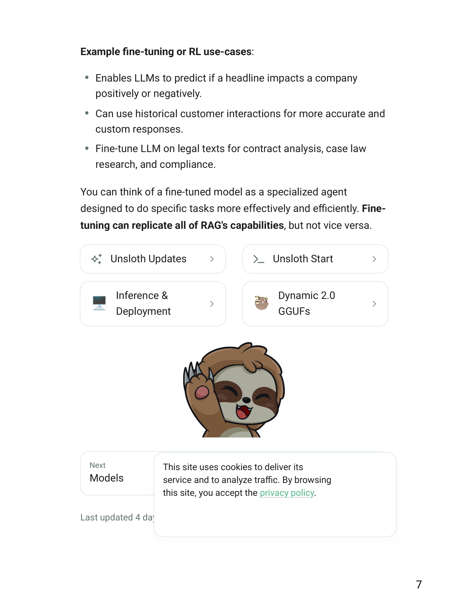

# Unsloth Docs - Unsloth Documentation

1
Get Started
🦥Unsloth Docs
Unsloth is an open-source framework for running and
training LLMs.
Unsloth lets you run and train AI models on your own local
hardware via an open-source UI.
Our docs will guide you through running & training your own LLM
locally.
Get started
Our GitHub
Copy
Reddit
Discord
🇺🇸 English
This site uses cookies to deliver its
service and to analyze traffic. By browsing
this site, you accept the privacy policy.
Accept
Reject

2
Unsloth for AMD!
You can now run & train models
on AMD.
GLM-5.2
Run the strongest open model
locally.
Unsloth Start
Connect to your agent to any
local LLM.
DeepSeek-V4
Run the new 284B Flash model.
Dynamic NVFP4
Run models 2x faster on your
Blackwell GPU.
Introducing Unsloth Studio
New open, no-code UI to train
and run LLMs.
This site uses cookies to deliver its
service and to analyze traffic. By browsing
this site, you accept the privacy policy.

3
Complete LLM
Directory
🧬
Fine-tuning Guide
🔮
Models
Unsloth API
Unsloth supports MacOS, Linux, Windows, NVIDIA, AMD, Intel and
CPU setups. See: Unsloth Requirements. Use the same commands
to update:
MacOS, Linux, WSL:
Windows PowerShell:
⚡ Quickstart
curl -fsSL https://unsloth.ai/install.sh | sh
irm https://unsloth.ai/install.ps1 | iex
This site uses cookies to deliver its
service and to analyze traffic. By browsing
this site, you accept the privacy policy.

4
Unsloth Start lets you connect 
Claude Code, Codex and other
agents to local models via the 
unsloth start command.
Start Unsloth, load a model, open
your project folder, and then run:
Replace claude with any agent
below:
• We directly collab with teams behind gpt-oss , Qwen3 , Llama
4 , Mistral , Gemma 1-3 and Phi-4 , where we’ve fixed
critical bugs that greatly improved model accuracy. Andrej
Karpathy for example has praised our work .
👾 Unsloth Start
unsloth start claude
Claude Code running with
Qwen3.5 locally.
Agent
Command
 Claude Code
unsloth start claude
 OpenAI Codex
unsloth start codex
 Hermes Agent
unsloth start hermes
 OpenClaw
unsloth start openclaw
 OpenCode
unsloth start opencode
🦥 Why Unsloth?
This site uses cookies to deliver its
service and to analyze traffic. By browsing
this site, you accept the privacy policy.

5
• Unsloth streamlines local training, inference, data, and
deployment
• Unsloth supports inference and training for 500+ models: 
vision, TTS, embedding, RL
Unsloth lets you run and train models for text, audio , embedding
, vision and more. Unsloth provides many key features for both
inference and training:
• Self-healing tool calling / web search and use Unsloth as an
API.
• Connect your local models to any agent: Claude Code, Codex, 
Hermes and more.
• Search + download + run any model like GGUFs, LoRA adapters,
safetensors.
• Auto inference parameter tuning and edit chat templates.
• Export or save your model to GGUF, 16-bit safetensor etc.
• Compare outputs with two different model side by side.
• Train and RL 500+ models ~2x faster with ~70% less VRAM (no
accuracy loss)
• Supports full fine-tuning, pre-training, 4-bit, 16-bit and FP8
training.
⭐ Features
Inference
Training
This site uses cookies to deliver its
service and to analyze traffic. By browsing
this site, you accept the privacy policy.

6
• Auto-create datasets from PDF, CSV, DOCX files. Edit data in a
visual node workflow.
• Observability: Monitor training live, track loss, GPU usage,
customize graphs
• Most efficient reinforcement learning library, using 80% less
VRAM for GRPO, FP8 etc.
• Multi-GPU works but a much better version is coming!
Fine-tuning an LLM customizes its behavior, enhances domain
knowledge, and optimizes performance for specific tasks. By fine-
tuning a pre-trained model (e.g. Llama-3.1-8B) on a dataset, you
can:
• Update Knowledge: Introduce new domain-specific information.
• Customize Behavior: Adjust the model’s tone, personality, or
response style.
• Optimize for Tasks: Improve accuracy and relevance for
specific use cases.
Reinforcement Learning (RL) is where an "agent" learns to make
decisions by interacting with an environment and receiving 
feedback in the form of rewards or penalties.
• Action: What the model generates (e.g. a sentence).
• Reward: A signal indicating how good or bad the model's action
was (e.g. did the response follow instructions? was it helpful?).
• Environment: The scenario or task the model is working on
(e.g. answering a user’s question).
What is Fine-tuning and RL? Why?
This site uses cookies to deliver its
service and to analyze traffic. By browsing
this site, you accept the privacy policy.

7
Example fine-tuning or RL use-cases:
• Enables LLMs to predict if a headline impacts a company
positively or negatively.
• Can use historical customer interactions for more accurate and
custom responses.
• Fine-tune LLM on legal texts for contract analysis, case law
research, and compliance.
You can think of a fine-tuned model as a specialized agent
designed to do specific tasks more effectively and efficiently. Fine-
tuning can replicate all of RAG's capabilities, but not vice versa.
Unsloth Updates
🖥️
Inference &
Deployment
Unsloth Start
🦥
Dynamic 2.0
GGUFs
Next
Models
Last updated 4 days ago
Was this helpful?
This site uses cookies to deliver its
service and to analyze traffic. By browsing
this site, you accept the privacy policy.

8
Community
Reddit r/unsloth
Twitter (X)
LinkedIn
Resources
Tutorials
Docker
Hugging Face
Company
Unsloth Studio
Contact
Events
© Unsloth, 2026
This site uses cookies to deliver its
service and to analyze traffic. By browsing
this site, you accept the privacy policy.

## Extracted images

(pulled from the source doc by `.migrate/extract_images.py` -- Markdown conversion drops these; see `Unsloth Docs - Unsloth Documentation.pdf_images/`)

-  -- embedded raster
-  -- embedded raster
-  -- embedded raster
-  -- embedded raster
-  -- embedded raster
-  -- embedded raster
-  -- embedded raster
-  -- embedded raster
-  -- embedded raster
-  -- embedded raster
-  -- embedded raster
-  -- embedded raster
-  -- embedded raster
-  -- embedded raster
-  -- embedded raster
-  -- embedded raster
-  -- embedded raster
-  -- embedded raster
-  -- embedded raster
-  -- embedded raster
-  -- embedded raster
-  -- embedded raster
-  -- embedded raster
-  -- embedded raster
-  -- embedded raster
-  -- embedded raster
-  -- embedded raster
-  -- embedded raster
-  -- embedded raster
-  -- embedded raster
-  -- embedded raster
-  -- embedded raster
-  -- embedded raster
-  -- embedded raster
-  -- embedded raster
-  -- embedded raster
-  -- embedded raster
-  -- embedded raster
-  -- embedded raster
-  -- embedded raster
-  -- embedded raster
-  -- embedded raster
-  -- embedded raster
-  -- embedded raster
-  -- embedded raster
-  -- embedded raster
-  -- embedded raster
-  -- embedded raster
-  -- embedded raster
-  -- embedded raster
-  -- embedded raster
-  -- embedded raster
-  -- embedded raster
-  -- embedded raster
-  -- embedded raster
-  -- embedded raster
-  -- embedded raster
-  -- embedded raster
-  -- embedded raster
-  -- embedded raster
-  -- embedded raster
-  -- embedded raster
-  -- embedded raster
-  -- embedded raster
-  -- embedded raster
-  -- embedded raster
-  -- embedded raster
-  -- embedded raster
-  -- embedded raster
-  -- embedded raster
-  -- embedded raster
-  -- embedded raster
-  -- embedded raster
-  -- embedded raster
-  -- embedded raster
-  -- embedded raster
-  -- embedded raster
-  -- embedded raster
-  -- embedded raster
-  -- embedded raster
-  -- embedded raster
-  -- embedded raster
-  -- embedded raster
-  -- embedded raster
-  -- embedded raster
-  -- embedded raster
-  -- embedded raster
-  -- embedded raster
-  -- embedded raster
-  -- embedded raster
-  -- embedded raster
-  -- page 1 render (94 vector ops)
-  -- page 2 render (92 vector ops)
-  -- page 3 render (60 vector ops)
-  -- page 4 render (122 vector ops)
-  -- page 5 render (58 vector ops)
-  -- page 6 render (30 vector ops)
-  -- page 7 render (56 vector ops)
-  -- page 8 render (68 vector ops)
