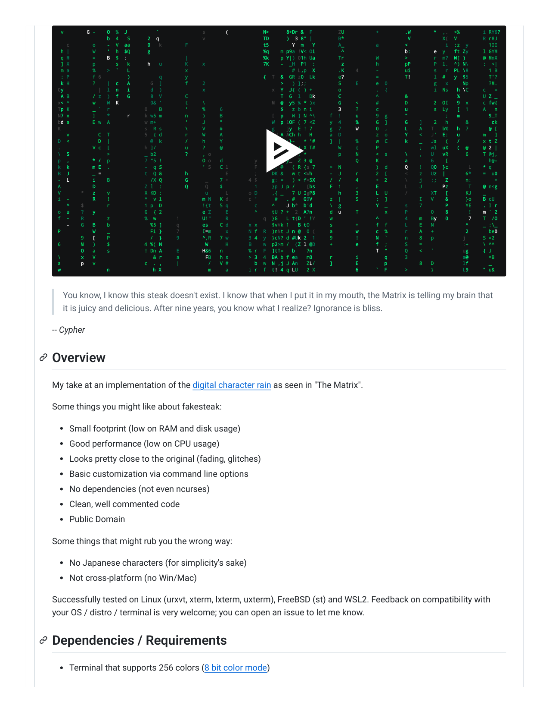
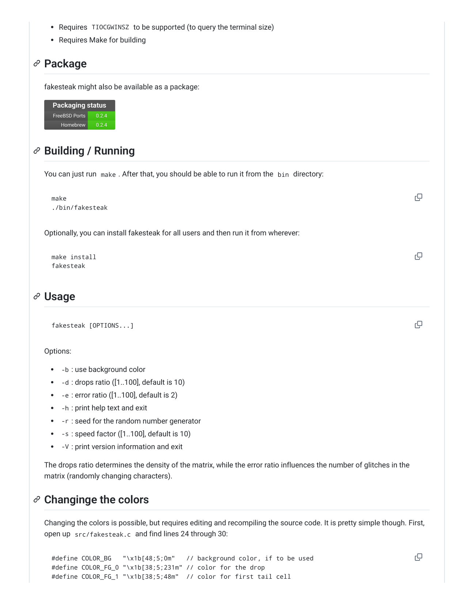
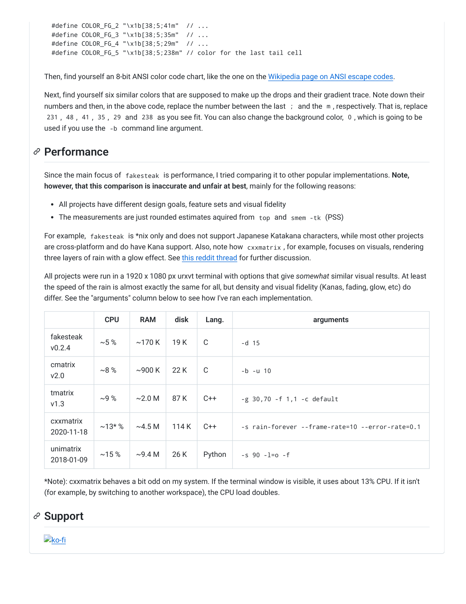

# c10vis-poem／fakesteak: All I see is blonde, brunette, red head. — Matrix Rain for your terminal, CC0.

Watch
0
All I see is blonde, brunette, red head. — Matrix Rain for your terminal, CC0.
Creative Commons Zero v1.0 Universal
0 stars
0 forks
0 watching
1 branch
0 tags
Activity
Public repository · Forked from domsson/fakesteak
1 Branch
0 Tags
Go to file
Go to file
Add file
Code
This branch is up to date with domsson/fakesteak:main .
Contribute
Sync fork
domsson Merge pull request domsson#7 from zyv/patch-1
5a9b61e · 8 months ago
.github
Create FUNDING.yml
4 years ago
bin
Initial commit
6 years ago
src
Use x1b everywhere, instead of a mix o…
4 years ago
.gitignore
allow example.png in gitignore
6 years ago
LICENSE
Initial commit
6 years ago
README.md
Update README.md: fix typo in file na…
last year
example.png
Remove example image on lighter bac…
6 years ago
makefile
Rename Makefile to makefile because …
4 years ago
c10vis-poem
fakesteak
Code
Pull requests
Agents
Actions
Projects
Security and quality
Insights
Settings
Fork
0
T
fakesteak
README
License

 v        G -    O  %  J          `               s       (            N>      8+Dr &  F         ZU           +         .W        *  ,.  <%        i RY6?   
                 b  4   S      2  q               v                    TD      )  3 8" |         B*                      V           X(  V         R r8J    
   c        o    -  V  aa      0   k        F                          t5        Y  m   Y        A_           a         <             i  :z  y       1II    
 h |        W    '  h  $Q      g                                       %q    m p9a !V< Oi         ^                     b:        e  y   ft Zy     l GYM    
 q M        =    B  $  :                    |                          %k    p Y|) 01h Ua        Tr           W         >         r  m?  W[ )      @ MnX    
 ] X        p       s   k      h   u        K     x                    7K    -  _H  P1  :         z           h         pP        P  l.  ^) N\     :  <|    
 m a        %    >  `   L                   x                                    # L,p  X        .K    4      -         ui        s   r  PL \8       1 B    
 : P        f 6         )          q        y                          {  T  &  GR z0  Lk        e?           =         T!        l  #   y  $5       T'?    
 k H        ?    |  c   A       G  ]        f     2                          >   ) ];;           S     E      e  0                g   x     Np       ?M.    
0y            |  l  n   i       d  )              x                       x  Y  J{ ( ) +         o            .  {                i  Ns   h \C     c   =    
 A B        / z  )  f   G       8  V        C                                T  6  l   Dk        C            ^         &                 %        U Z _    
x< ^        w    W  K           0& '        t     \                       M  @  y5 % * )x        G     <      #         D         2  OI   9  x     c fw{    
Tp K        _ `  r            0    B        '     %     6                    $   z b n i         3     ?      c         u         s  Ly   [  1     A   n    
N7 x        ]    *      r     k w5 m        n     )     B                 [  p   W ] N ^\     f  !     u      9  g      "             ;   m          9_T    
bd a        E w  A            w m+          '     J     "                 W  p lOF ( 7 <Z     y  4     %      G  ]      G    ]    2   h      &        ck    
K                             s  R s        \     V     #                 g    jy  E ! 7      g  7     W      0  ,      L    A   T   b%   h  7       @ [    
   v          C  T            5  { d        r     W     A                  W A ACh h   H      a  D            z  o      Y    <   J'  E:   u        m   ]    
D  <          D  |              @  k        /     h     Y                 4  d :}-   * '#     ]  |     %      w  C      k    _   Js   (   /        x t Z    
.           V c  [            h ]/          u     ?     @                 y. E $D- / X T#        W     {      P              ;   wl  uX   (  @     @ 2 |    
\  S             >            _ b2          ?     , o                     H    BM: ; *           p     N      <  s      \    ,   U   vR      6     T @j,    
p  ,        * /  p            7 "5 !              O o   d           y     N    y_  Z 3 @               Q      K         a        6    [              h@-    
k  k        m E  .            -  q S              ' 5   C l         F     r: @   ( R {s 7     >  N            )  d      Q    !   Q0  }c       L    * q      
B  J        _ =               t  Q &        h             E         ;     DK &   w t <Wh      -  J     r      2  [      <    z   Uz  |       6*    =  u0    
-  L        i    B              /X Q        G      _    7 +       4 $     g: =   ) < f=5X     /  /     4      +  2      \    j   ;;   Z      n:        +    
A           D                 Z l  :        Q      Q    $           1     }p J p /    [bs     F  1     ,      E         L    J       Pz       T    @ n<g    
V       *   z    v            X KD :               u      L       o D     ,{ _   7 U IgP8        h     3      L  U      /        XT   [      KJ    _        
i  -        R    !            *  v l              m N   K d       c '      #   . #   G9V      z  |     S      ;  ]           I   V    &      }o    B cU     
   ^    $        r            1 p  D              !{t   5 q         c     ^    J b*  b'd      \  g            Y  _      s    7        P      YE    . I r    
o  u    ?   y                 G  { 2              e Z     E         ^     tU ? +  2  A7n      d  u     T         x      P        0    8       !    m ` 2    
f  -    R        z            %  w       1        U1"     R            q  }G   L t{D ' !Y     w               ^         4    m   By   0       7    T  /O    
   -    G   B    b              %5 ]     q        es    C d       x x     $vVk 1   B tO       s        +      f  f      L    E   N           ^     _ :\_    
P           W    _              Fi }     7        I=m     x       N f  R  )nNt J n @  0 (     a        w      c  %      r    A   +           2       be0    
        9   [    P              /  }     9        ^,R   7 w       3 4  y  }cN? d #Uk 2  1     9        !      N  `      n    8   p          j      S =2     
6       M   )    $            4 %( N               W      H       B    w  p2>m /  (Z l @D     +        e      f  ;      S    =              :+     \ ^^     
        O   a    s            ! Dn A     E        H&6   n         % r  F  ]tT=   b    7n                      T  "      Q    <   `          ug     { J      
\       x   V                    & r     a         FB   h s       > 3  4  BA b f ea   m0      r        i         q      3                   a@       =B     
a       p   v                 c  . ,     |          /   V #         b  w  N ,j J An   ZL/     ]        E         p           8   D          lf       _      
w                n               h X                m     a       i r  f  t! 4 q LU   2 X              6      `  F      >        }          L9     " u&     
You know, I know this steak doesn't exist. I know that when I put it in my mouth, the Matrix is telling my brain that
it is juicy and delicious. After nine years, you know what I realize? Ignorance is bliss.
-- Cypher
My take at an implementation of the digital character rain as seen in "The Matrix".
Some things you might like about fakesteak:
Small footprint (low on RAM and disk usage)
Good performance (low on CPU usage)
Looks pretty close to the original (fading, glitches)
Basic customization via command line options
No dependencies (not even ncurses)
Clean, well commented code
Public Domain
Some things that might rub you the wrong way:
No Japanese characters (for simplicity's sake)
Not cross-platform (no Win/Mac)
Successfully tested on Linux (urxvt, xterm, lxterm, uxterm), FreeBSD (st) and WSL2. Feedback on compatibility with
your OS / distro / terminal is very welcome; you can open an issue to let me know.
Terminal that supports 256 colors (8 bit color mode)
Overview
Dependencies / Requirements

Requires TIOCGWINSZ to be supported (to query the terminal size)
Requires Make for building
fakesteak might also be available as a package:
Packaging status
Packaging status
FreeBSD Ports
FreeBSD Ports
0.2.4
0.2.4
Homebrew
Homebrew
0.2.4
0.2.4
You can just run make . After that, you should be able to run it from the bin directory:
Optionally, you can install fakesteak for all users and then run it from wherever:
Options:
-b : use background color
-d : drops ratio ([1..100], default is 10)
-e : error ratio ([1..100], default is 2)
-h : print help text and exit
-r : seed for the random number generator
-s : speed factor ([1..100], default is 10)
-V : print version information and exit
The drops ratio determines the density of the matrix, while the error ratio influences the number of glitches in the
matrix (randomly changing characters).
Changing the colors is possible, but requires editing and recompiling the source code. It is pretty simple though. First,
open up src/fakesteak.c and find lines 24 through 30:
Package
Building / Running
make
./bin/fakesteak
make install
fakesteak
Usage
fakesteak [OPTIONS...]
Changinge the colors
#define COLOR_BG   "\x1b[48;5;0m"   // background color, if to be used
#define COLOR_FG_0 "\x1b[38;5;231m" // color for the drop
#define COLOR_FG_1 "\x1b[38;5;48m"  // color for first tail cell

Then, find yourself an 8-bit ANSI color code chart, like the one on the Wikipedia page on ANSI escape codes.
Next, find yourself six similar colors that are supposed to make up the drops and their gradient trace. Note down their
numbers and then, in the above code, replace the number between the last ; and the m , respectively. That is, replace
231 , 48 , 41 , 35 , 29 and 238 as you see fit. You can also change the background color, 0 , which is going to be
used if you use the -b command line argument.
Since the main focus of fakesteak is performance, I tried comparing it to other popular implementations. Note,
however, that this comparison is inaccurate and unfair at best, mainly for the following reasons:
All projects have different design goals, feature sets and visual fidelity
The measurements are just rounded estimates aquired from top and smem -tk (PSS)
For example, fakesteak is *nix only and does not support Japanese Katakana characters, while most other projects
are cross-platform and do have Kana support. Also, note how cxxmatrix , for example, focuses on visuals, rendering
three layers of rain with a glow effect. See this reddit thread for further discussion.
All projects were run in a 1920 x 1080 px urxvt terminal with options that give somewhat similar visual results. At least
the speed of the rain is almost exactly the same for all, but density and visual fidelity (Kanas, fading, glow, etc) do
differ. See the "arguments" column below to see how I've ran each implementation.
CPU
RAM
disk
Lang.
arguments
fakesteak
v0.2.4
~5 %
~170 K
19 K
C
-d 15
cmatrix
v2.0
~8 %
~900 K
22 K
C
-b -u 10
tmatrix
v1.3
~9 %
~2.0 M
87 K
C++
-g 30,70 -f 1,1 -c default
cxxmatrix
2020-11-18
~13* %
~4.5 M
114 K
C++
-s rain-forever --frame-rate=10 --error-rate=0.1
unimatrix
2018-01-09
~15 %
~9.4 M
26 K
Python
-s 90 -l=o -f
*Note): cxxmatrix behaves a bit odd on my system. If the terminal window is visible, it uses about 13% CPU. If it isn't
(for example, by switching to another workspace), the CPU load doubles.
ko-fi
#define COLOR_FG_2 "\x1b[38;5;41m"  // ...
#define COLOR_FG_3 "\x1b[38;5;35m"  // ...
#define COLOR_FG_4 "\x1b[38;5;29m"  // ...
#define COLOR_FG_5 "\x1b[38;5;238m" // color for the last tail cell
Performance
Support

Releases
No releases published
Create a new release
Packages
No packages published
Publish your first package
Contributors
No contributors
Languages
C 97.5%
Makefile 2.5%
Suggested workflows
Based on your tech stack
MSBuild based projects
Build a MSBuild based project.
By GitHub Actions
Configure
C/C++ with Make
Build and test a C/C++ project using Make.
By GitHub Actions
Configure
CMake based, single-platform projects
Build and test a CMake based project on a single-platform.
By GitHub Actions
Configure
More workflows

## Extracted images

(pulled from the source doc by `.migrate/extract_images.py` -- Markdown conversion drops these; see `c10vis-poem／fakesteak: All I see is blonde, brunette, red head. — Matrix Rain for your terminal, CC0..pdf_images/`)

-  -- embedded raster
-  -- embedded raster
-  -- embedded raster
-  -- embedded raster
-  -- embedded raster
-  -- embedded raster
-  -- embedded raster
-  -- embedded raster
-  -- embedded raster
-  -- embedded raster
-  -- embedded raster
-  -- embedded raster
-  -- page 1 render (300 vector ops)
-  -- page 2 render (42 vector ops)
-  -- page 3 render (100 vector ops)
-  -- page 4 render (310 vector ops)
-  -- page 5 render (94 vector ops)
