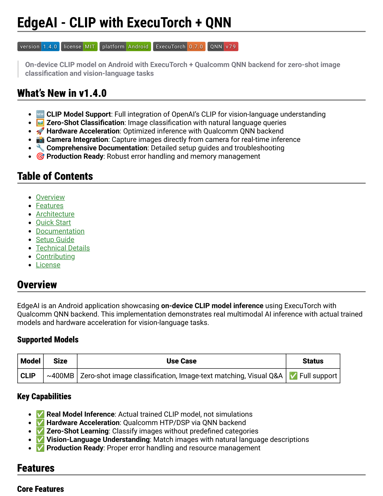
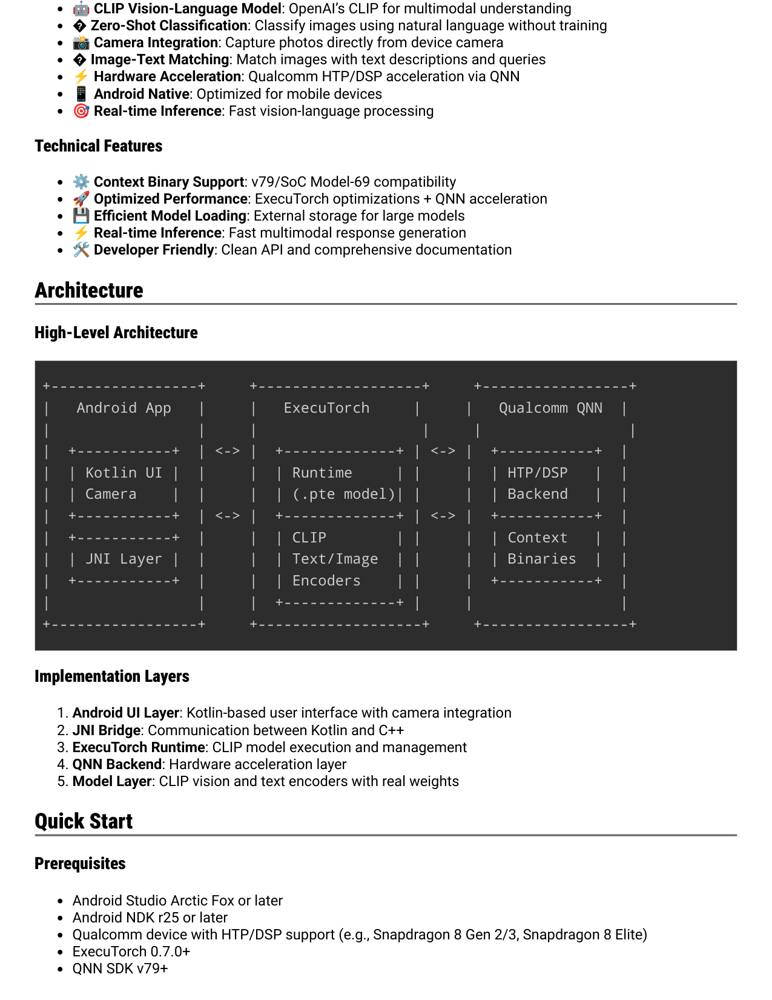
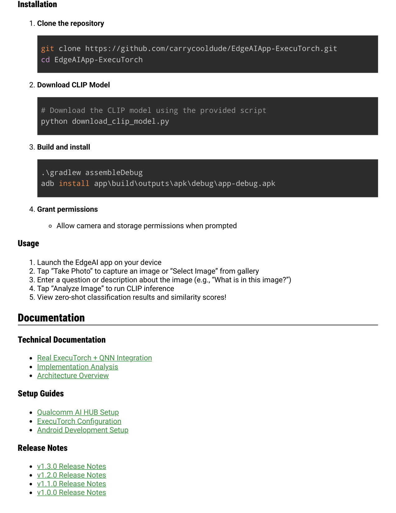
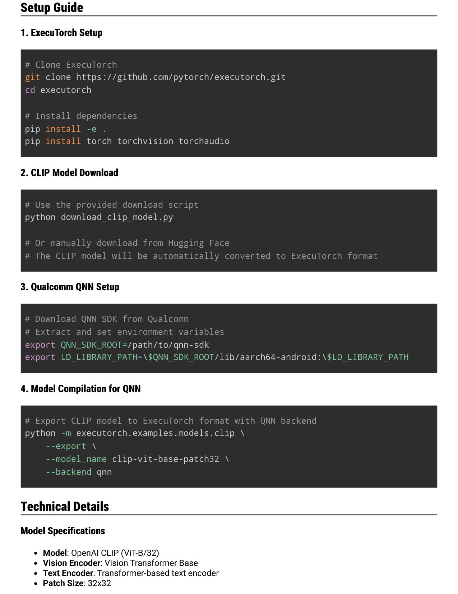
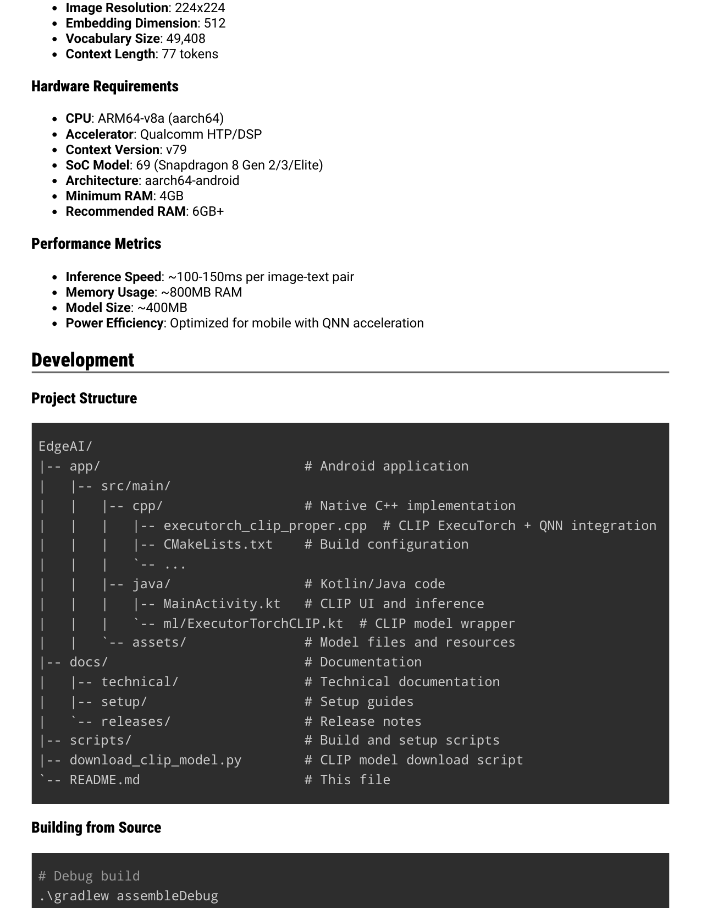
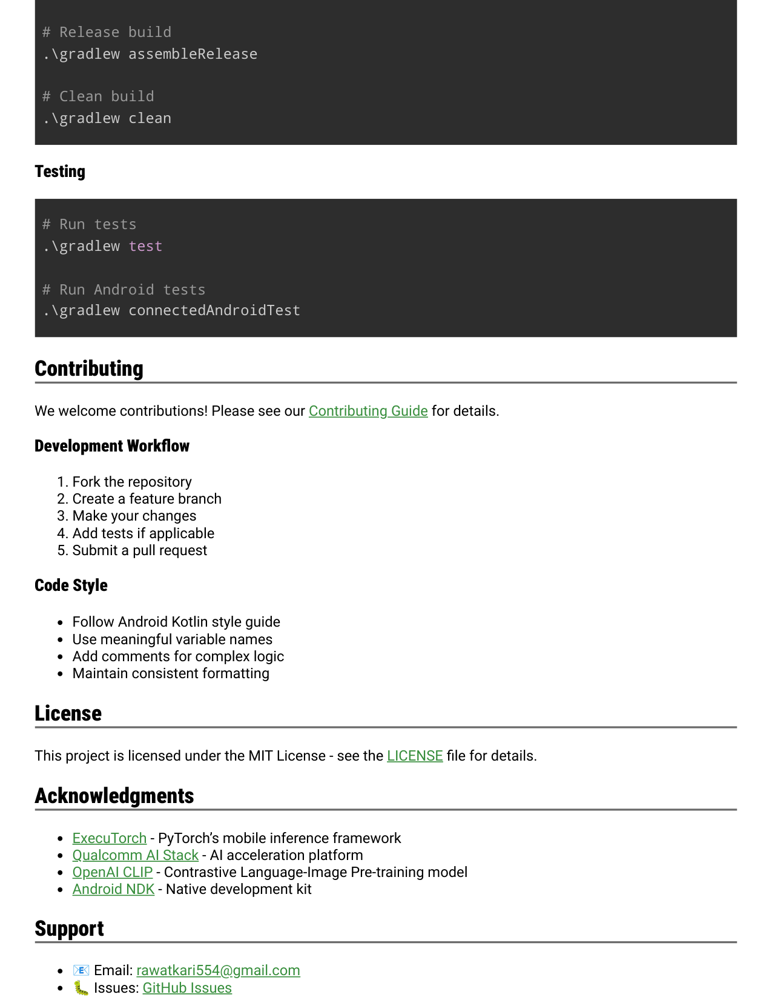

# EdgeAI - CLIP with ExecuTorch + QNN

EdgeAI - CLIP with ExecuTorch + QNN
version
version 1.4.0
1.4.0
license
license MIT
MIT
platform
platform Android
Android
ExecuTorch
ExecuTorch 0.7.0
0.7.0
QNN
QNN v 7 9
v 7 9
On-device CLIP model on Android with ExecuTorch + Qualcomm QNN backend for zero-shot image
classification and vision-language tasks
What’s New in v1.4.0
🆕 CLIP Model Support: Full integration of OpenAI’s CLIP for vision-language understanding
🖼️ Zero-Shot Classification: Image classification with natural language queries
🚀 Hardware Acceleration: Optimized inference with Qualcomm QNN backend
📸 Camera Integration: Capture images directly from camera for real-time inference
🔧 Comprehensive Documentation: Detailed setup guides and troubleshooting
🎯 Production Ready: Robust error handling and memory management
Table of Contents
Overview
Features
Architecture
Quick Start
Documentation
Setup Guide
Technical Details
Contributing
License
Overview
EdgeAI is an Android application showcasing on-device CLIP model inference using ExecuTorch with
Qualcomm QNN backend. This implementation demonstrates real multimodal AI inference with actual trained
models and hardware acceleration for vision-language tasks.
Supported Models
Model
Size
Use Case
Status
CLIP
~400MB
Zero-shot image classification, Image-text matching, Visual Q&A
✅ Full support
Key Capabilities
✅ Real Model Inference: Actual trained CLIP model, not simulations
✅ Hardware Acceleration: Qualcomm HTP/DSP via QNN backend
✅ Zero-Shot Learning: Classify images without predefined categories
✅ Vision-Language Understanding: Match images with natural language descriptions
✅ Production Ready: Proper error handling and resource management
Features
Core Features

🤖 CLIP Vision-Language Model: OpenAI’s CLIP for multimodal understanding
G️ Zero-Shot Classification: Classify images using natural language without training
📸 Camera Integration: Capture photos directly from device camera
G Image-Text Matching: Match images with text descriptions and queries
⚡ Hardware Acceleration: Qualcomm HTP/DSP acceleration via QNN
📱 Android Native: Optimized for mobile devices
🎯 Real-time Inference: Fast vision-language processing
Technical Features
⚙️ Context Binary Support: v79/SoC Model-69 compatibility
🚀 Optimized Performance: ExecuTorch optimizations + QNN acceleration
💾 Efficient Model Loading: External storage for large models
⚡ Real-time Inference: Fast multimodal response generation
🛠️ Developer Friendly: Clean API and comprehensive documentation
Architecture
High-Level Architecture
Implementation Layers
1. Android UI Layer: Kotlin-based user interface with camera integration
2. JNI Bridge: Communication between Kotlin and C++
3. ExecuTorch Runtime: CLIP model execution and management
4. QNN Backend: Hardware acceleration layer
5. Model Layer: CLIP vision and text encoders with real weights
Quick Start
Prerequisites
Android Studio Arctic Fox or later
Android NDK r25 or later
Qualcomm device with HTP/DSP support (e.g., Snapdragon 8 Gen 2/3, Snapdragon 8 Elite)
ExecuTorch 0.7.0+
QNN SDK v79+
+-----------------+     +-------------------+     +-----------------+
|   Android App   |     |   ExecuTorch     |     |   Qualcomm QNN  |
|                 |     |                   |     |                 |
|  +-----------+  | <-> |  +-------------+ | <-> |  +-----------+  |
|  | Kotlin UI |  |     |  | Runtime     | |     |  | HTP/DSP   |  |
|  | Camera    |  |     |  | (.pte model)| |     |  | Backend   |  |
|  +-----------+  | <-> |  +-------------+ | <-> |  +-----------+  |
|  +-----------+  |     |  | CLIP        | |     |  | Context   |  |
|  | JNI Layer |  |     |  | Text/Image  | |     |  | Binaries  |  |
|  +-----------+  |     |  | Encoders    | |     |  +-----------+  |
|                 |     |  +-------------+ |     |                 |
+-----------------+     +-------------------+     +-----------------+

Installation
1. Clone the repository
2. Download CLIP Model
3. Build and install
4. Grant permissions
Allow camera and storage permissions when prompted
Usage
1. Launch the EdgeAI app on your device
2. Tap “Take Photo” to capture an image or “Select Image” from gallery
3. Enter a question or description about the image (e.g., “What is in this image?”)
4. Tap “Analyze Image” to run CLIP inference
5. View zero-shot classification results and similarity scores!
Documentation
Technical Documentation
Real ExecuTorch + QNN Integration
Implementation Analysis
Architecture Overview
Setup Guides
Qualcomm AI HUB Setup
ExecuTorch Configuration
Android Development Setup
Release Notes
v1.3.0 Release Notes
v1.2.0 Release Notes
v1.1.0 Release Notes
v1.0.0 Release Notes
git clone https://github.com/carrycooldude/EdgeAIApp-ExecuTorch.git
cd EdgeAIApp-ExecuTorch
# Download the CLIP model using the provided script
python download_clip_model.py
.\gradlew assembleDebug
adb install app\build\outputs\apk\debug\app-debug.apk

Setup Guide
1. ExecuTorch Setup
2. CLIP Model Download
3. Qualcomm QNN Setup
4. Model Compilation for QNN
Technical Details
Model Specifications
Model: OpenAI CLIP (ViT-B/32)
Vision Encoder: Vision Transformer Base
Text Encoder: Transformer-based text encoder
Patch Size: 32x32
# Clone ExecuTorch
git clone https://github.com/pytorch/executorch.git
cd executorch
# Install dependencies
pip install -e .
pip install torch torchvision torchaudio
# Use the provided download script
python download_clip_model.py
# Or manually download from Hugging Face
# The CLIP model will be automatically converted to ExecuTorch format
# Download QNN SDK from Qualcomm
# Extract and set environment variables
export QNN_SDK_ROOT=/path/to/qnn-sdk
export LD_LIBRARY_PATH=\$QNN_SDK_ROOT/lib/aarch64-android:\$LD_LIBRARY_PATH
# Export CLIP model to ExecuTorch format with QNN backend
python -m executorch.examples.models.clip \
    --export \
    --model_name clip-vit-base-patch32 \
    --backend qnn

Image Resolution: 224x224
Embedding Dimension: 512
Vocabulary Size: 49,408
Context Length: 77 tokens
Hardware Requirements
CPU: ARM64-v8a (aarch64)
Accelerator: Qualcomm HTP/DSP
Context Version: v79
SoC Model: 69 (Snapdragon 8 Gen 2/3/Elite)
Architecture: aarch64-android
Minimum RAM: 4GB
Recommended RAM: 6GB+
Performance Metrics
Inference Speed: ~100-150ms per image-text pair
Memory Usage: ~800MB RAM
Model Size: ~400MB
Power Efficiency: Optimized for mobile with QNN acceleration
Development
Project Structure
Building from Source
EdgeAI/
|-- app/                          # Android application
|   |-- src/main/
|   |   |-- cpp/                  # Native C++ implementation
|   |   |   |-- executorch_clip_proper.cpp  # CLIP ExecuTorch + QNN integration
|   |   |   |-- CMakeLists.txt    # Build configuration
|   |   |   `-- ...
|   |   |-- java/                 # Kotlin/Java code
|   |   |   |-- MainActivity.kt   # CLIP UI and inference
|   |   |   `-- ml/ExecutorTorchCLIP.kt  # CLIP model wrapper
|   |   `-- assets/               # Model files and resources
|-- docs/                         # Documentation
|   |-- technical/                # Technical documentation
|   |-- setup/                    # Setup guides
|   `-- releases/                 # Release notes
|-- scripts/                      # Build and setup scripts
|-- download_clip_model.py        # CLIP model download script
`-- README.md                     # This file
# Debug build
.\gradlew assembleDebug

Testing
Contributing
We welcome contributions! Please see our Contributing Guide for details.
Development Workflow
1. Fork the repository
2. Create a feature branch
3. Make your changes
4. Add tests if applicable
5. Submit a pull request
Code Style
Follow Android Kotlin style guide
Use meaningful variable names
Add comments for complex logic
Maintain consistent formatting
License
This project is licensed under the MIT License - see the LICENSE file for details.
Acknowledgments
ExecuTorch - PyTorch’s mobile inference framework
Qualcomm AI Stack - AI acceleration platform
OpenAI CLIP - Contrastive Language-Image Pre-training model
Android NDK - Native development kit
Support
📧 Email: rawatkari554@gmail.com
🐛 Issues: GitHub Issues
# Release build
.\gradlew assembleRelease
# Clean build
.\gradlew clean
# Run tests
.\gradlew test
# Run Android tests
.\gradlew connectedAndroidTest

💬 Discussions: GitHub Discussions
Made with ❤️ for the AI community

## Extracted images

(pulled from the source doc by `.migrate/extract_images.py` -- Markdown conversion drops these; see `EdgeAI - CLIP with ExecuTorch + QNN.pdf_images/`)

-  -- embedded raster
-  -- embedded raster
-  -- embedded raster
-  -- embedded raster
-  -- embedded raster
-  -- embedded raster
-  -- embedded raster
-  -- embedded raster
-  -- embedded raster
-  -- embedded raster
-  -- embedded raster
-  -- embedded raster
-  -- embedded raster
-  -- embedded raster
-  -- embedded raster
-  -- embedded raster
-  -- embedded raster
-  -- embedded raster
-  -- embedded raster
-  -- embedded raster
-  -- page 1 render (138 vector ops)
-  -- page 2 render (44 vector ops)
-  -- page 3 render (54 vector ops)
-  -- page 4 render (24 vector ops)
-  -- page 5 render (40 vector ops)
-  -- page 6 render (52 vector ops)
-  -- page 7 render (16 vector ops)
