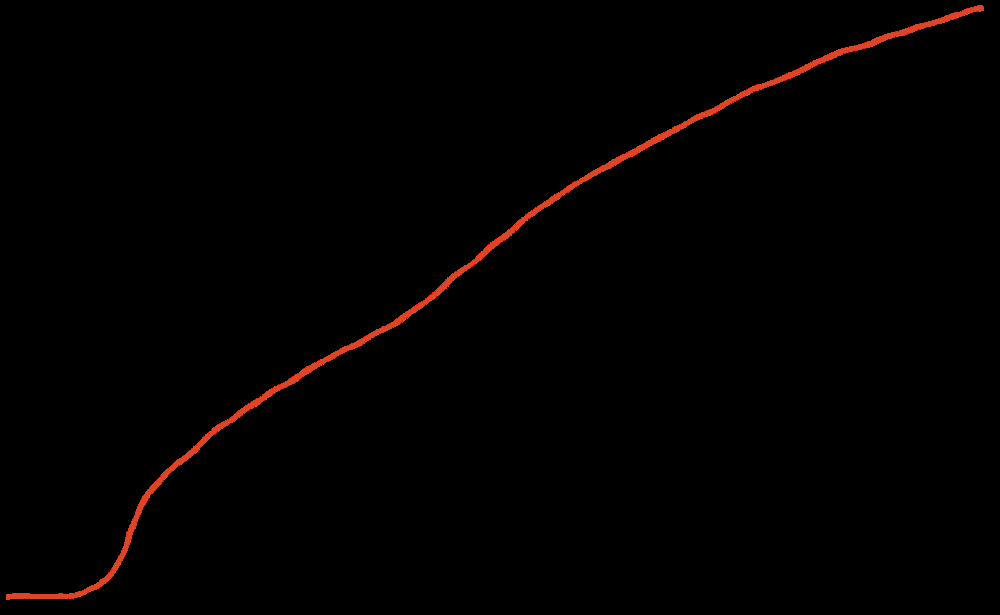
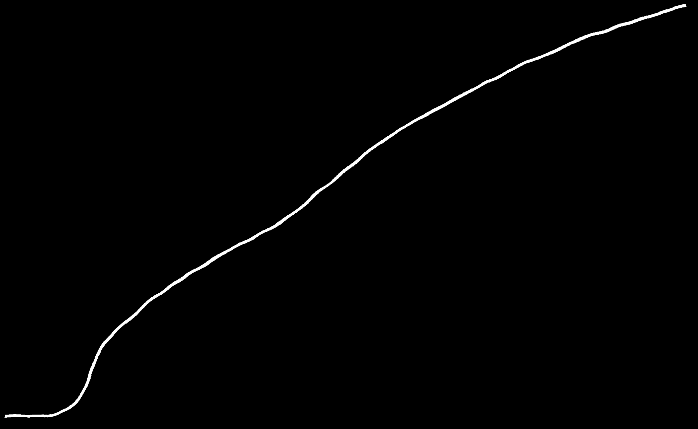
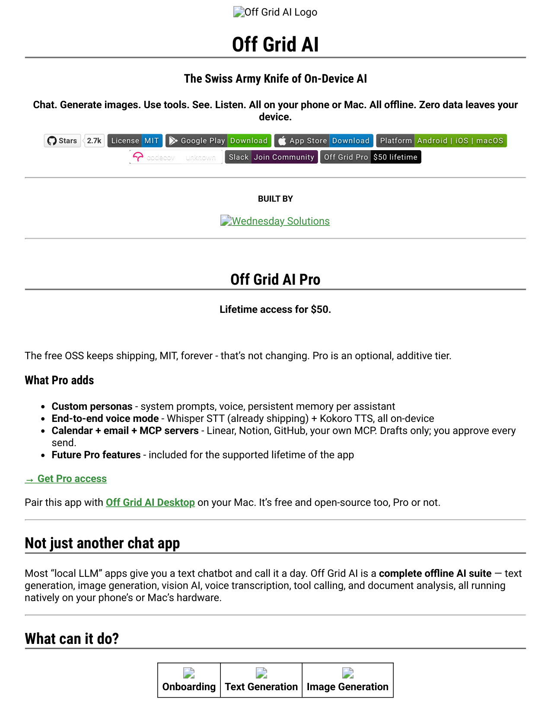
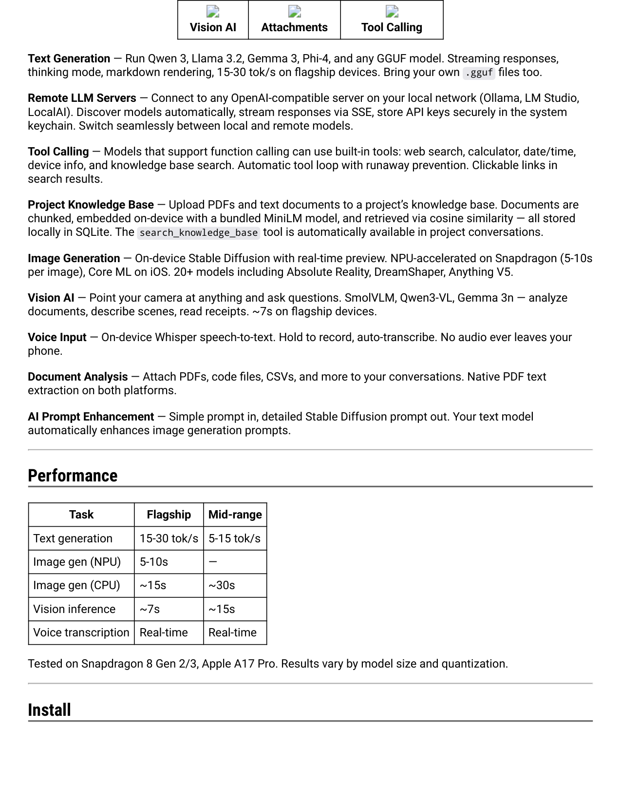
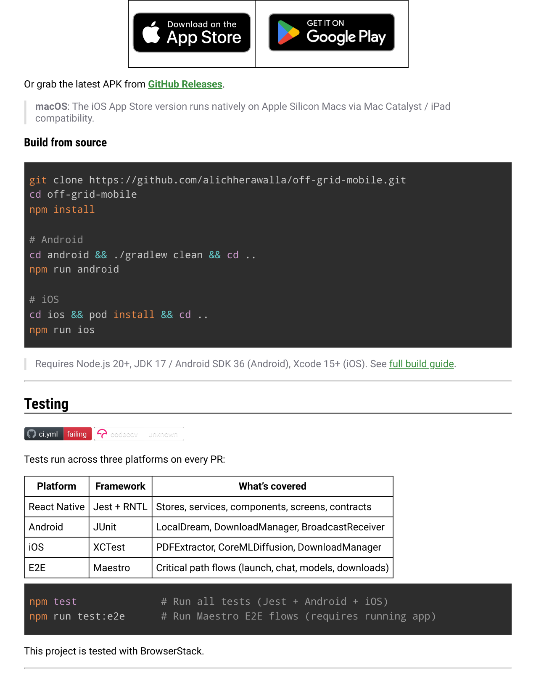
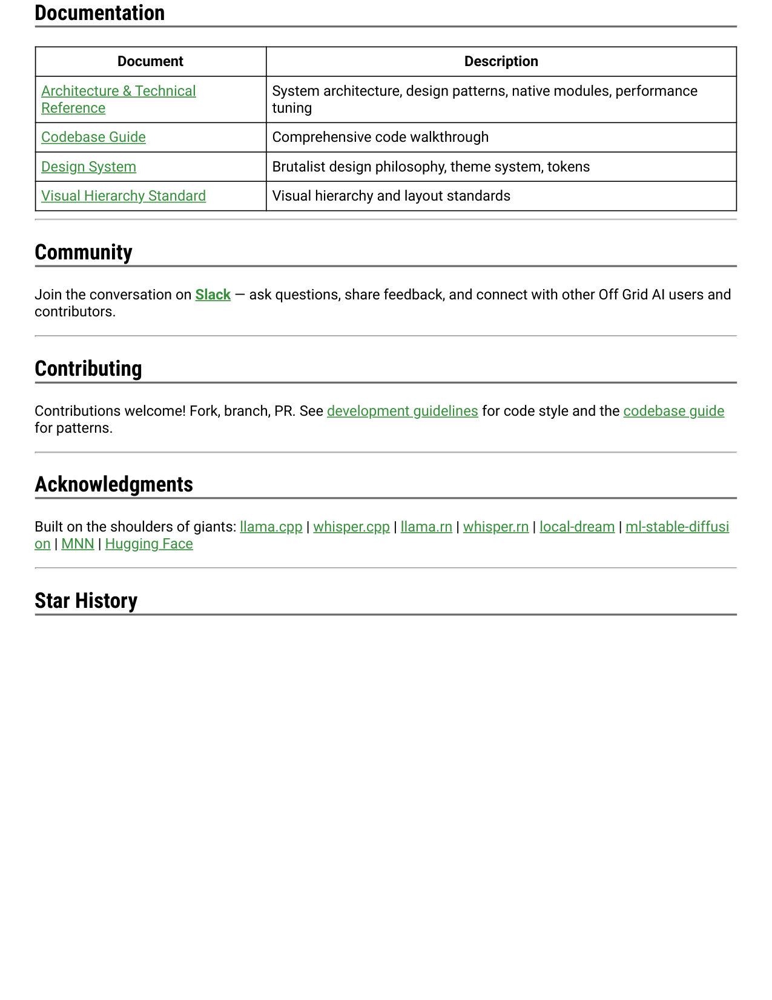
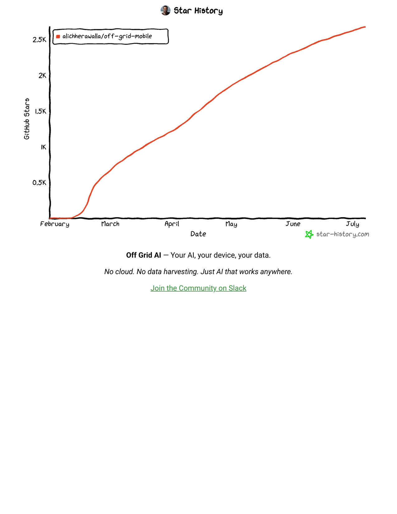

# Off Grid AI

Off Grid AI Logo
Off Grid AI
The Swiss Army Knife of On-Device AI
Chat. Generate images. Use tools. See. Listen. All on your phone or Mac. All offline. Zero data leaves your
device.
Stars
Stars
2.7k
2.7k
License
License MIT
MIT
Google Play
Google Play Download
Download
App Store
App Store Download
Download
Platform
Platform Android | iOS | macOS
Android | iOS | macOS
codecov
codecov
unknown
unknown
Slack
Slack Join Community
Join Community
Off Grid Pro
Off Grid Pro $50 lifetime
$50 lifetime
BUILT BY
Wednesday Solutions
Off Grid AI Pro
Lifetime access for $50.
The free OSS keeps shipping, MIT, forever - that’s not changing. Pro is an optional, additive tier.
What Pro adds
Custom personas - system prompts, voice, persistent memory per assistant
End-to-end voice mode - Whisper STT (already shipping) + Kokoro TTS, all on-device
Calendar + email + MCP servers - Linear, Notion, GitHub, your own MCP. Drafts only; you approve every
send.
Future Pro features - included for the supported lifetime of the app
→ Get Pro access
Pair this app with Off Grid AI Desktop on your Mac. It’s free and open-source too, Pro or not.
Not just another chat app
Most “local LLM” apps give you a text chatbot and call it a day. Off Grid AI is a complete offline AI suite — text
generation, image generation, vision AI, voice transcription, tool calling, and document analysis, all running
natively on your phone’s or Mac’s hardware.
What can it do?
Onboarding
Text Generation
Image Generation

Vision AI
Attachments
Tool Calling
Text Generation — Run Qwen 3, Llama 3.2, Gemma 3, Phi-4, and any GGUF model. Streaming responses,
thinking mode, markdown rendering, 15-30 tok/s on flagship devices. Bring your own .gguf files too.
Remote LLM Servers — Connect to any OpenAI-compatible server on your local network (Ollama, LM Studio,
LocalAI). Discover models automatically, stream responses via SSE, store API keys securely in the system
keychain. Switch seamlessly between local and remote models.
Tool Calling — Models that support function calling can use built-in tools: web search, calculator, date/time,
device info, and knowledge base search. Automatic tool loop with runaway prevention. Clickable links in
search results.
Project Knowledge Base — Upload PDFs and text documents to a project’s knowledge base. Documents are
chunked, embedded on-device with a bundled MiniLM model, and retrieved via cosine similarity — all stored
locally in SQLite. The search_knowledge_base tool is automatically available in project conversations.
Image Generation — On-device Stable Diffusion with real-time preview. NPU-accelerated on Snapdragon (5-10s
per image), Core ML on iOS. 20+ models including Absolute Reality, DreamShaper, Anything V5.
Vision AI — Point your camera at anything and ask questions. SmolVLM, Qwen3-VL, Gemma 3n — analyze
documents, describe scenes, read receipts. ~7s on flagship devices.
Voice Input — On-device Whisper speech-to-text. Hold to record, auto-transcribe. No audio ever leaves your
phone.
Document Analysis — Attach PDFs, code files, CSVs, and more to your conversations. Native PDF text
extraction on both platforms.
AI Prompt Enhancement — Simple prompt in, detailed Stable Diffusion prompt out. Your text model
automatically enhances image generation prompts.
Performance
Task
Flagship
Mid-range
Text generation
15-30 tok/s
5-15 tok/s
Image gen (NPU)
5-10s
—
Image gen (CPU)
~15s
~30s
Vision inference
~7s
~15s
Voice transcription
Real-time
Real-time
Tested on Snapdragon 8 Gen 2/3, Apple A17 Pro. Results vary by model size and quantization.
Install

Or grab the latest APK from GitHub Releases.
macOS: The iOS App Store version runs natively on Apple Silicon Macs via Mac Catalyst / iPad
compatibility.
Build from source
Requires Node.js 20+, JDK 17 / Android SDK 36 (Android), Xcode 15+ (iOS). See full build guide.
Testing
ci.yml
ci.yml
failing
failing
codecov
codecov
unknown
unknown
Tests run across three platforms on every PR:
Platform
Framework
What’s covered
React Native
Jest + RNTL
Stores, services, components, screens, contracts
Android
JUnit
LocalDream, DownloadManager, BroadcastReceiver
iOS
XCTest
PDFExtractor, CoreMLDiffusion, DownloadManager
E2E
Maestro
Critical path flows (launch, chat, models, downloads)
This project is tested with BrowserStack.
git clone https://github.com/alichherawalla/off-grid-mobile.git
cd off-grid-mobile
npm install
# Android
cd android && ./gradlew clean && cd ..
npm run android
# iOS
cd ios && pod install && cd ..
npm run ios
npm test              # Run all tests (Jest + Android + iOS)
npm run test:e2e      # Run Maestro E2E flows (requires running app)

Documentation
Document
Description
Architecture & Technical
Reference
System architecture, design patterns, native modules, performance
tuning
Codebase Guide
Comprehensive code walkthrough
Design System
Brutalist design philosophy, theme system, tokens
Visual Hierarchy Standard
Visual hierarchy and layout standards
Community
Join the conversation on Slack — ask questions, share feedback, and connect with other Off Grid AI users and
contributors.
Contributing
Contributions welcome! Fork, branch, PR. See development guidelines for code style and the codebase guide
for patterns.
Acknowledgments
Built on the shoulders of giants: llama.cpp | whisper.cpp | llama.rn | whisper.rn | local-dream | ml-stable-diffusi
on | MNN | Hugging Face
Star History

star-history.com
February
March
April
May
June
July
0.5K
1K
1.5K
2K
2.5K
alichherawalla/off-grid-mobile
Star History
Date
GitHub Stars
Off Grid AI — Your AI, your device, your data.
No cloud. No data harvesting. Just AI that works anywhere.
Join the Community on Slack

## Extracted images

(pulled from the source doc by `.migrate/extract_images.py` -- Markdown conversion drops these; see `Off Grid AI.pdf_images/`)

-  -- embedded raster
-  -- embedded raster
-  -- embedded raster
-  -- embedded raster
-  -- embedded raster
-  -- embedded raster
-  -- embedded raster
-  -- embedded raster
-  -- embedded raster
-  -- embedded raster
-  -- embedded raster
-  -- embedded raster
-  -- embedded raster
-  -- embedded raster
-  -- embedded raster
-  -- embedded raster
-  -- embedded raster
-  -- embedded raster
-  -- embedded raster
-  -- embedded raster
-  -- embedded raster
-  -- embedded raster
-  -- embedded raster
-  -- embedded raster
-  -- embedded raster
-  -- embedded raster
-  -- embedded raster
-  -- embedded raster
-  -- embedded raster
-  -- embedded raster
-  -- embedded raster
-  -- embedded raster
-  -- embedded raster
-  -- embedded raster
-  -- embedded raster
-  -- embedded raster
-  -- embedded raster
-  -- embedded raster
-  -- embedded raster
-  -- embedded raster
-  -- embedded raster
-  -- embedded raster
-  -- embedded raster
-  -- embedded raster
-  -- embedded raster
-  -- page 1 render (138 vector ops)
-  -- page 2 render (138 vector ops)
-  -- page 3 render (188 vector ops)
-  -- page 4 render (134 vector ops)
-  -- page 5 render (20 vector ops)
