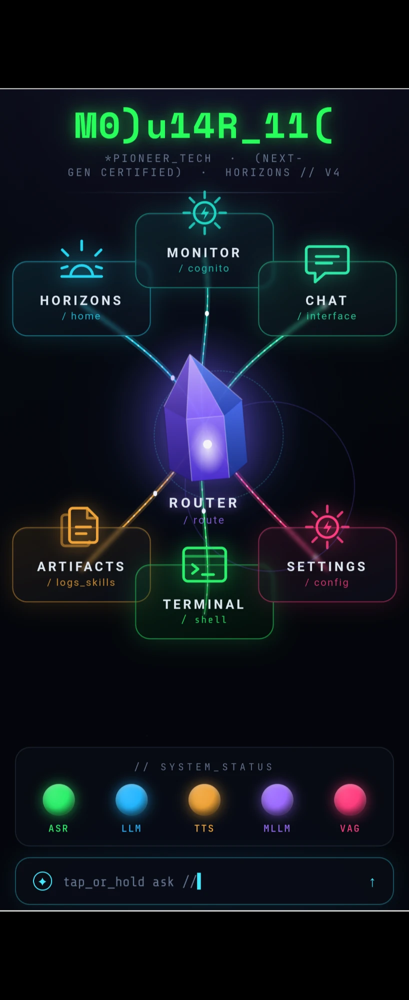

# Clock Face — the six rooms and the hub

> **What this is.** The canonical room layout for the Novus Agenti home screen:
> which room sits at which clock position, and what each room owns. Read this
> before writing, correcting, or citing any document that describes the app's
> rooms.
>
> **Guiding principle.** This is a **layout and ownership map, not an
> implementation status report.** Every room named here exists as a *position
> with an assigned role*. Several of them have **no backing code at all** — see
> `../STATE-OF-EXISTENCE.md` before assuming any of it runs.
>
> **Verification rule.** The layout is confirmed when two independent operator
> sources agree. They do (below). Any document contradicting this one is wrong
> and gets corrected — **except `HomeGrid.kt`, which is frozen** and is not
> touched to satisfy this doc.

---

## 1 · The layout — stated twice, independently

> **Operator** (`HOME-REDESIGN-SPEC.md` §1): *"The tile layout is 12 o'clck –
> 2:00 – 4:00 – 6 o'clock – 8:00 – 10:00."*
> *"All seven of those should be pretty symmetrical … that wheel itself is just
> slightly bumped up a little bit."*

> **Operator** (Gemini thread, 2026-08-04, correcting a four-room draft):
> *"Again, dude, everything's at 2:00, 4:00, 6:00, 8:00, 10:00, and 12:00."*

> **Operator** (same thread, correcting the *next* draft, which still dropped rooms):
> *"You left out the monitor and the browser. And you left out the whole chat
> interface."*

**Spec.** Six tiles on a clock face plus a centre hub — **seven elements**:

| Pos | Room | Colour | Owns |
|---|---|---|---|
| **12:00** | **MONITOR** | teal/cyan | scope gatekeeper + verification; the green-light call. Styled as a **stand-up arcade cabinet** (`MONITOR-ARCADE-CABINET-SPEC.md`); also renders the 10:00 Easter-egg game |
| **2:00** | **CHAT** | its own softer green | multi-modal chat, artifacts, embedded web view, the 22 agentic OS tools |
| **4:00** | **SETTINGS** | pink/crimson | the vault — SAF picker, `ACTION_VIEW`/`ACTION_SEND` "Open With" intent catchers, asset pointers |
| **6:00** | **TERMINAL** | near-black bg + bright matrix green | Termux shell staging; forges parameter packets; manages launch + recovery daemons |
| **8:00** | **ARCHIVES** | amber | saved runtime snapshots, verified execution profiles, parameter history, session logs |
| **10:00** | **HORIZONS** | blue, **amber** sun | about/credits — build version, model credits, open-source attribution; carries the hidden unlockable game payload |
| **centre** | **ROUTER** | violet crystal, **white** label | the hub. Styled as a **component stereo stack** (`ROUTER-STEREO-STACK-SPEC.md`) |

Two pieces of retro hardware, two different tiles: **Router = stereo stack**
(load media, tune it, switch it on). **Monitor = arcade cabinet** (walk up, look
at the screen, read the placard, hit a button).

Beyond the wheel: the **Floating Horizons Live Tile** (always-on overlay —
screen-vision capture, mic trigger, live meta-prompting) and the **sleep handler**
(3–5 min idle → the chonk screensaver).

> **Operator:** *"Don't forget about the crash log / easter egg goat pop up and
> the screen timeout guardian chonk."*

---

## 2 · Tile labels — verbatim

Every tile carries: **TITLE** · `/slug` · subtitle · bottom prompt line.

> **Operator:** *"Monitor /cognito, library. And in the bottom prompt line of the
> tile can read $_browser."*
> *"Chat /interface, tools, bottom prompt line of the tile can read $_model."*
> *"Settings /config, vault, bottom prompt line of the tile can read $_utils."*
> *"Terminal /shell, commands, bottom line of the tile can read $_bash."*
> *"Archive /logs, artifacts, in the bottom line can read $_files."*
> *"Horizons /about, credits, bottom line can read $_version.s … or $_.home"*

> **Operator (Router):** *"No /route at the bottom. The core_hub slug is at the top
> right under the icon. `$_Statio` only thing underneath ROUTER."*
> *"Router is always white — I've never said it's the text, I mean the ROUTER
> [label] is white; obviously the icon is the violet."*

**Spec.**

| Room | Title | Slug | Subtitle | Prompt |
|---|---|---|---|---|
| 12:00 | `MONITOR` | `/cognito` | library | `$_browser` |
| 2:00 | `CHAT` | `/interface` | tools | `$_model` |
| 4:00 | `SETTINGS` | `/config` | vault | `$_utils` |
| 6:00 | `TERMINAL` | `/shell` | commands | `$_bash` |
| 8:00 | `ARCHIVES` | `/logs` | artifacts | `$_files` |
| 10:00 | `HORIZONS` | `/about` | credits | `$_.home` |
| centre | `ROUTER` (white) | `// CORE_HUB` (above) | — | `$_Statio` |

`ARCHIVES` was previously mislabelled `ARTIFACTS`: *"Archives is actually labeled
— instead of ARTIFACTS it'll be ARCHIVES."*

---

## 3 · Conflict — `Horizons-UI/CLAUDE.md` describes a superseded layout

**Artifact:** `c10vis-poem/Horizons-UI` → `CLAUDE.md`, "AUTHORITY MODEL" and
"Seven tiles feed a center-hub Router."

That file describes rooms at **Settings 4:30 / Terminal 6:00 / Monitor 12:00 /
Router centre** and builds its whole authority model on those four alone. It
**omits Chat (2:00), Archives (8:00), and Horizons (10:00) entirely.**

**Spec.** That layout descends from the **superseded four-room draft** — the same
draft the operator corrected twice in the Gemini thread. It is not canon.

- Canon is the **6 + 1 clock face** in §1.
- `4:30` is wrong; Settings is at **4:00**.
- The Settings→Monitor→Router series-circuit authority model in that file is not
  invalidated by this — but it is **incomplete**, because it never accounts for
  Archives holding the verified profiles the Router restores from, or for Chat
  owning the agentic tool surface.
- **`HomeGrid.kt` remains frozen at `984b061`.** This is a documentation
  correction. Nothing here authorises a code change.

**Recorded, not resolved** — per `../TEMPLATE.md`, the conflict is stated so the
next reader sees both. The `CLAUDE.md` correction is an operator call.

---

## 4 · What is PERFECT — do not touch

> **Operator:** *"The overall spacing ratio, size ratios, color hues, placement of
> the upper logo and the bottom chat bar and bottom configuration nodes … those
> are the only two things on here that are perfect."*

Top logo placement · bottom chat bar placement · bottom status nodes
(ASR/LLM/TTS/MLLM/VAG) · overall spacing ratios, size ratios, colour hues.

---

## 5 · Status ledger

- ✅ Six-room + hub layout — **operator-confirmed twice, independently.**
- ✅ Tile labels/slugs/prompts — operator-dictated verbatim.
- ✅ Monitor = arcade cabinet, Router = stereo stack — direction captured.
- ⛔ Four-room layout (Settings 4:30) — **superseded.** Still present in
  `Horizons-UI/CLAUDE.md`.
- ⬜ Home forefront redesign — PENDING (see `HOME-REDESIGN-SPEC.md` §12).
- ⬜ Chat (2:00) agentic tool surface — **no backing code.** See
  `../STATE-OF-EXISTENCE.md`.
- ⬜ Archives (8:00) as a real store — **no backing code.**
- ⬜ Horizons (10:00) pane + Easter-egg payload — **no backing code.**
- ⬜ Floating Live Tile — **no backing code.**

## 6 · Open / to-confirm

- Whether `Horizons-UI/CLAUDE.md` gets corrected in place or annotated — operator's call.
- Exact tile card style ("wrong style") is still unpinned — `HOME-REDESIGN-SPEC.md` §13.
- Horizons prompt line: operator offered `$_version.s` **or** `$_.home`; `$_.home`
  taken as cleanest, not explicitly ratified.
